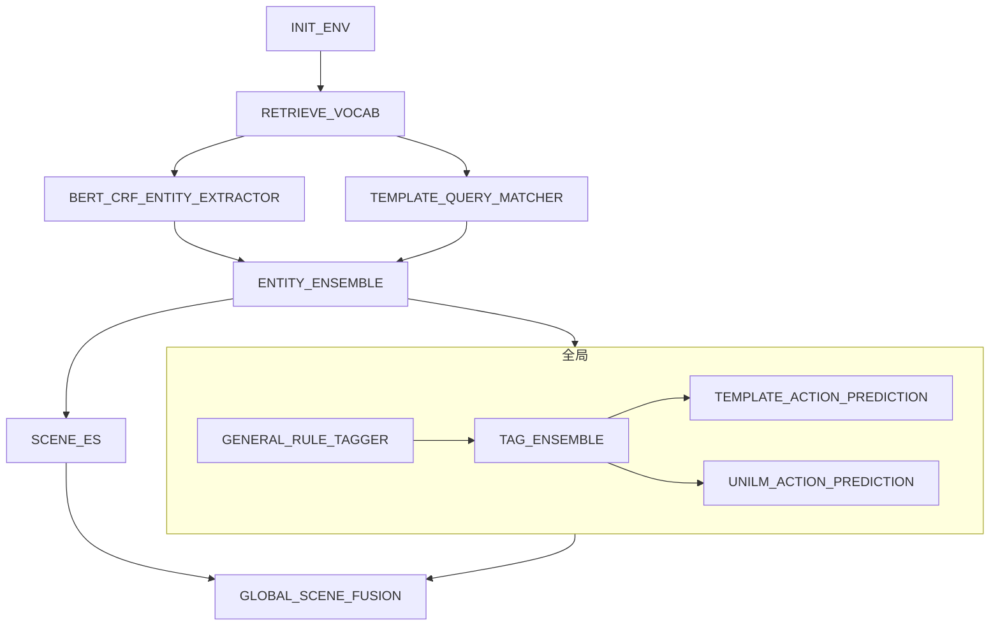

# 1.simple workflow



## template json

```json
{
  "name": "工作流",
  "sequentialSteps": [
    {
      "name": "初始化操作",
      "component": "INIT_ENV"
    },
    {
      "name": "获取词汇表",
      "component": "RETRIEVE_VOCAB"
    },
    {
      "name": "并行执行",
      "parallelSteps": [
        {
          "component": "BERT_CRF_ENTITY_EXTRACTOR"
        },
        {
          "component": "TEMPLATE_QUERY_MATCHER"
        }
      ]
    },
    {
      "name": "实体集成",
      "component": "ENTITY_ENSEMBLE"
    },
    {
      "name": "并行执行全局节点和可见及可说节点",
      "parallelSteps": [
        {
          "name": "全局节点",
          "sequentialSteps": [
            {
              "name": "初始化操作",
              "component": "GENERAL_RULE_TAGGER"
            },
            {
              "name": "标签集成",
              "component": "TAG_ENSEMBLE"
            },
            {
              "name": "并行执行预测",
              "parallelSteps": [
                {
                  "component": "TEMPLATE_ACTION_PREDICTION"
                },
                {
                  "component": "UNILM_ACTION_PREDICTION"
                }
              ]
            }
          ]
        },
        {
          "name": "场景ES",
          "component": "SCENE_ES"
        }
      ]
    },
    {
      "name": "全局场景融合",
      "component": "GLOBAL_SCENE_FUSION"
    }
  ]
}
```

## UT
``` shell
mvn clean test -D test=com.xiaopeng.workflow.HelloEasyFlowBpmnApplicationTests#testConvertXPComp -e

  .   ____          _            __ _ _
 /\\ / ___'_ __ _ _(_)_ __  __ _ \ \ \ \
( ( )\___ | '_ | '_| | '_ \/ _` | \ \ \ \
 \\/  ___)| |_)| | | | | || (_| |  ) ) ) )
  '  |____| .__|_| |_|_| |_\__, | / / / /
 =========|_|==============|___/=/_/_/_/
 :: Spring Boot ::               (v3.1.10)

18:14:04.803 [main] INFO  c.x.w.HelloEasyFlowBpmnApplicationTests - Starting HelloEasyFlowBpmnApplicationTests using Java 21.0.2 with PID 60328 (started by lixp in /Users/lixp/lxpConfig/lxpNewWorkSpace/hello-easy-flow-bpmn)
18:14:04.804 [main] INFO  c.x.w.HelloEasyFlowBpmnApplicationTests - No active profile set, falling back to 1 default profile: "default"
18:14:05.885 [main] INFO  c.x.w.HelloEasyFlowBpmnApplicationTests - Started HelloEasyFlowBpmnApplicationTests in 1.309 seconds (process running for 2.419)
WARNING: A Java agent has been loaded dynamically (/Users/lixp/lxpConfig/J2EE/maven_repo/net/bytebuddy/byte-buddy-agent/1.14.12/byte-buddy-agent-1.14.12.jar)
WARNING: If a serviceability tool is in use, please run with -XX:+EnableDynamicAgentLoading to hide this warning
WARNING: If a serviceability tool is not in use, please run with -Djdk.instrument.traceUsage for more information
WARNING: Dynamic loading of agents will be disallowed by default in a future release
Java HotSpot(TM) 64-Bit Server VM warning: Sharing is only supported for boot loader classes because bootstrap classpath has been appended
18:14:07.007 [main] INFO  c.x.w.components.XPWorkFLowBuilder - build sequential component:{"name":"工作流","sequentialSteps":[{"name":"初始化操作","component":"INIT_ENV","type":"s"},{"name":"获取词汇表","component":"RETRIEVE_VOCAB","type":"single"},{"name":"并行执行","parallelSteps":[{"component":"BERT_CRF_ENTITY_EXTRACTOR","type":"single"},{"component":"TEMPLATE_QUERY_MATCHER","type":"single"}],"type":"parallel"},{"name":"实体集成","component":"ENTITY_ENSEMBLE","type":"single"},{"name":"并行执行全局节点和可见及可说节点","parallelSteps":[{"name":"全局节点","sequentialSteps":[{"name":"初始化操作","component":"GENERAL_RULE_TAGGER","type":"single"},{"name":"标签集成","component":"TAG_ENSEMBLE","type":"single"}ame":"并行执行预测","parallelSteps":[{"component":"TEMPLATE_ACTION_PREDICTION","type":"single"},{"component":"UNILM_ACTION_PREDICTION","type":"single"}],"type":"parallel"}],"type":"sequential"},{"name":"场景ES","component":"SCENE_ES","type":"single"}],"type":"parallel"},{"name":"全局场景融合","component":"GLOBAL_SCENE_FUSION","type":"single"}],"type":"sequential"}
18:14:07.010 [main] INFO  c.x.w.components.XPWorkFLowBuilder - build single component:INIT_ENV
18:14:07.010 [main] INFO  c.x.w.components.XPWorkFLowBuilder - build single component:RETRIEVE_VOCAB
18:14:07.010 [main] INFO  c.x.w.components.XPWorkFLowBuilder - build parallel component:{"name":"并行执行","parallelSteps":[{"component":"BERT_CRF_ENTITY_EXTRACTOR","type":"single"},{"component":"TEMPLATE_QUERY_MATCHER","type":"single"}],"type":"parallel"}
18:14:07.010 [main] INFO  c.x.w.components.XPWorkFLowBuilder - build single component:BERT_CRF_ENTITY_EXTRACTOR
18:14:07.010 [main] INFO  c.x.w.components.XPWorkFLowBuilder - build single component:TEMPLATE_QUERY_MATCHER
18:14:07.013 [main] INFO  c.x.w.components.XPWorkFLowBuilder - build single component:ENTITY_ENSEMBLE
18:14:07.014 [main] INFO  c.x.w.components.XPWorkFLowBuilder - build parallel component:{"name":"并行执行全局节点和可见及可说节点","parallelSteps":[{"name":"全局节点","sequentialS":[{"name":"初始化操作","component":"GENERAL_RULE_TAGGER","type":"single"},{"name":"标签集成","component":"TAG_ENSEMBLE","type":"single"},{"name":"并行执行预测","parallelSteps":[{"component":"TEMPLATE_ACTION_PREDICTION","type":"single"},{"component":"UNILM_ACTION_PREDICTION","type":"single"}],"type":"parallel"}],"type":"sequential"},{"name":"场景ES","compont":"SCENE_ES","type":"single"}],"type":"parallel"}
18:14:07.015 [main] INFO  c.x.w.components.XPWorkFLowBuilder - build sequential component:{"name":"全局节点","sequentialSteps":[{"name":"初始化操作","component":"GENERAL_RULE_TAGG":"single"},{"name":"标签集成","component":"TAG_ENSEMBLE","type":"single"},{"name":"并行执行预测","parallelSteps":[{"component":"TEMPLATE_ACTION_PREDICTION","type":"single"},{"comNILM_ACTION_PREDICTION","type":"single"}],"type":"parallel"}],"type":"sequential"}
18:14:07.015 [main] INFO  c.x.w.components.XPWorkFLowBuilder - build single component:GENERAL_RULE_TAGGER
18:14:07.015 [main] INFO  c.x.w.components.XPWorkFLowBuilder - build single component:TAG_ENSEMBLE
18:14:07.015 [main] INFO  c.x.w.components.XPWorkFLowBuilder - build parallel component:{"name":"并行执行预测","parallelSteps":[{"component":"TEMPLATE_ACTION_PREDICTION","type":"single"},{"component":"UNILM_ACTION_PREDICTION","type":"single"}],"type":"parallel"}
18:14:07.015 [main] INFO  c.x.w.components.XPWorkFLowBuilder - build single component:TEMPLATE_ACTION_PREDICTION
18:14:07.015 [main] INFO  c.x.w.components.XPWorkFLowBuilder - build single component:UNILM_ACTION_PREDICTION
18:14:07.017 [main] INFO  c.x.w.components.XPWorkFLowBuilder - build single component:SCENE_ES
18:14:07.017 [main] INFO  c.x.w.components.XPWorkFLowBuilder - build single component:GLOBAL_SCENE_FUSION
18:14:07.017 [main] INFO  o.j.flows.engine.WorkFlowEngineImpl - Running workflow ''505006d4-2f83-4829-8887-61f9c9388f25''
18:14:07.017 [main] INFO  c.x.w.HelloEasyFlowBpmnApplicationTests - INIT_ENV execute start
18:14:08.862 [main] INFO  c.x.w.HelloEasyFlowBpmnApplicationTests - INIT_ENV execute end ==> cost time:1841ms
18:14:08.864 [main] INFO  c.x.w.HelloEasyFlowBpmnApplicationTests - RETRIEVE_VOCAB execute start
18:14:12.691 [main] INFO  c.x.w.HelloEasyFlowBpmnApplicationTests - RETRIEVE_VOCAB execute end ==> cost time:3823ms
18:14:12.695 [pool-2-thread-1] INFO  c.x.w.HelloEasyFlowBpmnApplicationTests - BERT_CRF_ENTITY_EXTRACTOR execute start
18:14:12.695 [pool-2-thread-2] INFO  c.x.w.HelloEasyFlowBpmnApplicationTests - TEMPLATE_QUERY_MATCHER execute start
18:14:13.927 [pool-2-thread-1] INFO  c.x.w.HelloEasyFlowBpmnApplicationTests - BERT_CRF_ENTITY_EXTRACTOR execute end ==> cost time:1230ms
18:14:17.257 [pool-2-thread-2] INFO  c.x.w.HelloEasyFlowBpmnApplicationTests - TEMPLATE_QUERY_MATCHER execute end ==> cost time:4560ms
18:14:17.257 [main] INFO  c.x.w.HelloEasyFlowBpmnApplicationTests - ENTITY_ENSEMBLE execute start
18:14:18.492 [main] INFO  c.x.w.HelloEasyFlowBpmnApplicationTests - ENTITY_ENSEMBLE execute end ==> cost time:1230ms
18:14:18.493 [pool-2-thread-3] INFO  c.x.w.HelloEasyFlowBpmnApplicationTests - GENERAL_RULE_TAGGER execute start
18:14:18.493 [pool-2-thread-4] INFO  c.x.w.HelloEasyFlowBpmnApplicationTests - SCENE_ES execute start
18:14:19.856 [pool-2-thread-3] INFO  c.x.w.HelloEasyFlowBpmnApplicationTests - GENERAL_RULE_TAGGER execute end ==> cost time:1360ms
18:14:19.857 [pool-2-thread-3] INFO  c.x.w.HelloEasyFlowBpmnApplicationTests - TAG_ENSEMBLE execute start
18:14:19.925 [pool-2-thread-4] INFO  c.x.w.HelloEasyFlowBpmnApplicationTests - SCENE_ES execute end ==> cost time:1427ms
18:14:21.800 [pool-2-thread-3] INFO  c.x.w.HelloEasyFlowBpmnApplicationTests - TAG_ENSEMBLE execute end ==> cost time:1939ms
18:14:21.801 [pool-2-thread-6] INFO  c.x.w.HelloEasyFlowBpmnApplicationTests - UNILM_ACTION_PREDICTION execute start
18:14:21.801 [pool-2-thread-5] INFO  c.x.w.HelloEasyFlowBpmnApplicationTests - TEMPLATE_ACTION_PREDICTION execute start
18:14:23.993 [pool-2-thread-5] INFO  c.x.w.HelloEasyFlowBpmnApplicationTests - TEMPLATE_ACTION_PREDICTION execute end ==> cost time:2189ms
18:14:26.086 [pool-2-thread-6] INFO  c.x.w.HelloEasyFlowBpmnApplicationTests - UNILM_ACTION_PREDICTION execute end ==> cost time:4282ms
18:14:26.086 [main] INFO  c.x.w.HelloEasyFlowBpmnApplicationTests - globalSceneFusion execute start
18:14:27.471 [main] INFO  c.x.w.HelloEasyFlowBpmnApplicationTests - GLOBAL_SCENE_FUSION execute end ==> cost time:1380ms
18:14:27.471 [main] INFO  c.x.w.HelloEasyFlowBpmnApplicationTests - report:DefaultWorkReport {status=COMPLETED, context=context={}}, error=''}
[INFO] Tests run: 1, Failures: 0, Errors: 0, Skipped: 0, Time elapsed: 23.521 s - in com.xiaopeng.workflow.HelloEasyFlowBpmnApplicationTests
[INFO] 
[INFO] Results:
[INFO] 
[INFO] Tests run: 1, Failures: 0, Errors: 0, Skipped: 0
[INFO] 
[INFO] ------------------------------------------------------------------------
[INFO] BUILD SUCCESS
[INFO] ------------------------------------------------------------------------
[INFO] Total time:  28.276 s
[INFO] Finished at: 2024-04-18T18:14:27+08:00
[INFO] ------------------------------------------------------------------------
[WARNING] The requested profile "downloadSources" could not be activated because it does not exist.
 ~/lxpConfig/lxpNewWorkSpace/hello-easy-flow-bpmn/ [main+*] 


```