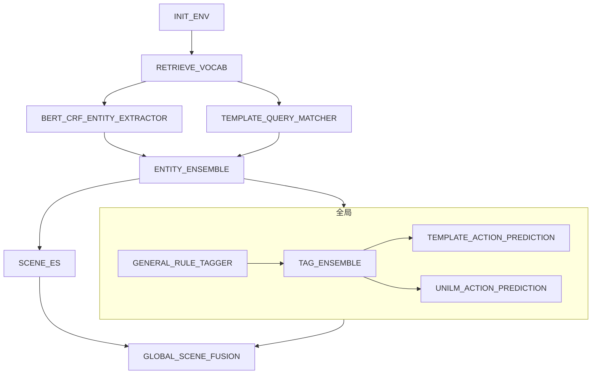

# 1.simple workflow



## template json

```json
{
  "name": "工作流",
  "sequentialSteps": [
    {
      "name": "初始化操作",
      "component": "INIT_ENV"
    },
    {
      "name": "获取词汇表",
      "component": "RETRIEVE_VOCAB"
    },
    {
      "name": "并行执行",
      "parallelSteps": [
        {
          "component": "BERT_CRF_ENTITY_EXTRACTOR"
        },
        {
          "component": "TEMPLATE_QUERY_MATCHER"
        }
      ]
    },
    {
      "name": "实体集成",
      "component": "ENTITY_ENSEMBLE"
    },
    {
      "name": "并行执行全局节点和可见及可说节点",
      "parallelSteps": [
        {
          "name": "全局节点",
          "sequentialSteps": [
            {
              "name": "初始化操作",
              "component": "GENERAL_RULE_TAGGER"
            },
            {
              "name": "标签集成",
              "component": "TAG_ENSEMBLE"
            },
            {
              "name": "并行执行预测",
              "parallelSteps": [
                {
                  "component": "TEMPLATE_ACTION_PREDICTION"
                },
                {
                  "component": "UNILM_ACTION_PREDICTION"
                }
              ]
            }
          ]
        },
        {
          "name": "场景ES",
          "component": "SCENE_ES"
        }
      ]
    },
    {
      "name": "全局场景融合",
      "component": "GLOBAL_SCENE_FUSION"
    }
  ]
}
```

## UT
``` shell
mvn clean test -D test=com.xiaopeng.workflow.HelloEasyFlowBpmnApplicationTests#testConvertXPComp -e

2024-04-18T18:06:15.332+08:00  INFO 58929 --- [           main] c.x.w.components.XPWorkFLowBuilder       : build sequential component:{"name":"工作流","sequentialSteps":[{"name":"初始化操作","component":"INIT_ENV","type":"single"},{"name":"获取词汇表","component":"RETRIEVE_VOCAB","type":"single"},{"name":"并行执行","parallelSteps":[{"component":"BERT_CRF_EY_EXTRACTOR","type":"single"},{"component":"TEMPLATE_QUERY_MATCHER","type":"single"}],"type":"parallel"},{"name":"实体集成","component":"ENTITY_ENSEMBLE","type":"single"},{"name":"并行执行全局节点和可见及可说节点","parallelSteps":[{"name":"全局节点","sequentialSteps":[{"name":"初始化操作","component":"GENERAL_RULE_TAGGER","type":"single"},{"name":"标签集成:"TAG_ENSEMBLE","type":"single"},{"name":"并行执行预测","parallelSteps":[{"component":"TEMPLATE_ACTION_PREDICTION","type":"single"},{"component":"UNILM_ACTION_PREDICTION","type":""}],"type":"parallel"}],"type":"sequential"},{"name":"场景ES","component":"SCENE_ES","type":"single"}],"type":"parallel"},{"name":"全局场景融合","component":"GLOBAL_SCENE_FUSION",single"}],"type":"sequential"}
2024-04-18T18:06:15.336+08:00  INFO 58929 --- [           main] c.x.w.components.XPWorkFLowBuilder       : build single component:INIT_ENV
2024-04-18T18:06:15.336+08:00  INFO 58929 --- [           main] c.x.w.components.XPWorkFLowBuilder       : build single component:RETRIEVE_VOCAB
2024-04-18T18:06:15.337+08:00  INFO 58929 --- [           main] c.x.w.components.XPWorkFLowBuilder       : build parallel component:{"name":"并行执行","parallelSteps":[{"componentERT_CRF_ENTITY_EXTRACTOR","type":"single"},{"component":"TEMPLATE_QUERY_MATCHER","type":"single"}],"type":"parallel"}
2024-04-18T18:06:15.337+08:00  INFO 58929 --- [           main] c.x.w.components.XPWorkFLowBuilder       : build single component:BERT_CRF_ENTITY_EXTRACTOR
2024-04-18T18:06:15.337+08:00  INFO 58929 --- [           main] c.x.w.components.XPWorkFLowBuilder       : build single component:TEMPLATE_QUERY_MATCHER
2024-04-18T18:06:15.347+08:00  INFO 58929 --- [           main] c.x.w.components.XPWorkFLowBuilder       : build single component:ENTITY_ENSEMBLE
2024-04-18T18:06:15.349+08:00  INFO 58929 --- [           main] c.x.w.components.XPWorkFLowBuilder       : build parallel component:{"name":"并行执行全局节点和可见及可说节点","pareps":[{"name":"全局节点","sequentialSteps":[{"name":"初始化操作","component":"GENERAL_RULE_TAGGER","type":"single"},{"name":"标签集成","component":"TAG_ENSEMBLE","type":"single"},{"name":"并行执行预测","parallelSteps":[{"component":"TEMPLATE_ACTION_PREDICTION","type":"single"},{"component":"UNILM_ACTION_PREDICTION","type":"single"}],"type":"parallel"}],"type":"sequential"},{"name":"场景ES","component":"SCENE_ES","type":"single"}],"type":"parallel"}
2024-04-18T18:06:15.351+08:00  INFO 58929 --- [           main] c.x.w.components.XPWorkFLowBuilder       : build sequential component:{"name":"全局节点","sequentialSteps":[{"name"化操作","component":"GENERAL_RULE_TAGGER","type":"single"},{"name":"标签集成","component":"TAG_ENSEMBLE","type":"single"},{"name":"并行执行预测","parallelSteps":[{"component":"TEMPLATE_ACTION_PREDICTION","type":"single"},{"component":"UNILM_ACTION_PREDICTION","type":"single"}],"type":"parallel"}],"type":"sequential"}
2024-04-18T18:06:15.351+08:00  INFO 58929 --- [           main] c.x.w.components.XPWorkFLowBuilder       : build single component:GENERAL_RULE_TAGGER
2024-04-18T18:06:15.352+08:00  INFO 58929 --- [           main] c.x.w.components.XPWorkFLowBuilder       : build single component:TAG_ENSEMBLE
2024-04-18T18:06:15.352+08:00  INFO 58929 --- [           main] c.x.w.components.XPWorkFLowBuilder       : build parallel component:{"name":"并行执行预测","parallelSteps":[{"compo:"TEMPLATE_ACTION_PREDICTION","type":"single"},{"component":"UNILM_ACTION_PREDICTION","type":"single"}],"type":"parallel"}
2024-04-18T18:06:15.352+08:00  INFO 58929 --- [           main] c.x.w.components.XPWorkFLowBuilder       : build single component:TEMPLATE_ACTION_PREDICTION
2024-04-18T18:06:15.352+08:00  INFO 58929 --- [           main] c.x.w.components.XPWorkFLowBuilder       : build single component:UNILM_ACTION_PREDICTION
2024-04-18T18:06:15.354+08:00  INFO 58929 --- [           main] c.x.w.components.XPWorkFLowBuilder       : build single component:SCENE_ES
2024-04-18T18:06:15.354+08:00  INFO 58929 --- [           main] c.x.w.components.XPWorkFLowBuilder       : build single component:GLOBAL_SCENE_FUSION
2024-04-18T18:06:15.355+08:00  INFO 58929 --- [           main] o.jeasy.flows.engine.WorkFlowEngineImpl  : Running workflow ''b6ceab35-df40-4585-b703-6d19c86e8de2''
2024-04-18T18:06:15.355+08:00  INFO 58929 --- [           main] c.x.w.HelloEasyFlowBpmnApplicationTests  : INIT_ENV execute start
2024-04-18T18:06:18.162+08:00  INFO 58929 --- [           main] c.x.w.HelloEasyFlowBpmnApplicationTests  : INIT_ENV execute end ==> cost time:2805ms
2024-04-18T18:06:18.163+08:00  INFO 58929 --- [           main] c.x.w.HelloEasyFlowBpmnApplicationTests  : RETRIEVE_VOCAB execute start
2024-04-18T18:06:19.817+08:00  INFO 58929 --- [           main] c.x.w.HelloEasyFlowBpmnApplicationTests  : RETRIEVE_VOCAB execute end ==> cost time:1651ms
2024-04-18T18:06:19.819+08:00  INFO 58929 --- [pool-2-thread-1] c.x.w.HelloEasyFlowBpmnApplicationTests  : BERT_CRF_ENTITY_EXTRACTOR execute start
2024-04-18T18:06:19.819+08:00  INFO 58929 --- [pool-2-thread-2] c.x.w.HelloEasyFlowBpmnApplicationTests  : TEMPLATE_QUERY_MATCHER execute start
2024-04-18T18:06:21.808+08:00  INFO 58929 --- [pool-2-thread-1] c.x.w.HelloEasyFlowBpmnApplicationTests  : BERT_CRF_ENTITY_EXTRACTOR execute end ==> cost time:1989ms
2024-04-18T18:06:24.711+08:00  INFO 58929 --- [pool-2-thread-2] c.x.w.HelloEasyFlowBpmnApplicationTests  : TEMPLATE_QUERY_MATCHER execute end ==> cost time:4888ms
2024-04-18T18:06:24.712+08:00  INFO 58929 --- [           main] c.x.w.HelloEasyFlowBpmnApplicationTests  : ENTITY_ENSEMBLE execute start
2024-04-18T18:06:29.324+08:00  INFO 58929 --- [           main] c.x.w.HelloEasyFlowBpmnApplicationTests  : ENTITY_ENSEMBLE execute end ==> cost time:4608ms
2024-04-18T18:06:29.326+08:00  INFO 58929 --- [pool-2-thread-3] c.x.w.HelloEasyFlowBpmnApplicationTests  : GENERAL_RULE_TAGGER execute start
2024-04-18T18:06:29.328+08:00  INFO 58929 --- [pool-2-thread-4] c.x.w.HelloEasyFlowBpmnApplicationTests  : SCENE_ES execute start
2024-04-18T18:06:29.450+08:00  INFO 58929 --- [pool-2-thread-3] c.x.w.HelloEasyFlowBpmnApplicationTests  : GENERAL_RULE_TAGGER execute end ==> cost time:119ms
2024-04-18T18:06:29.450+08:00  INFO 58929 --- [pool-2-thread-3] c.x.w.HelloEasyFlowBpmnApplicationTests  : TAG_ENSEMBLE execute start
2024-04-18T18:06:32.839+08:00  INFO 58929 --- [pool-2-thread-4] c.x.w.HelloEasyFlowBpmnApplicationTests  : SCENE_ES execute end ==> cost time:3507ms
2024-04-18T18:06:33.599+08:00  INFO 58929 --- [pool-2-thread-3] c.x.w.HelloEasyFlowBpmnApplicationTests  : TAG_ENSEMBLE execute end ==> cost time:4144ms
2024-04-18T18:06:33.600+08:00  INFO 58929 --- [pool-2-thread-6] c.x.w.HelloEasyFlowBpmnApplicationTests  : UNILM_ACTION_PREDICTION execute start
2024-04-18T18:06:33.600+08:00  INFO 58929 --- [pool-2-thread-5] c.x.w.HelloEasyFlowBpmnApplicationTests  : TEMPLATE_ACTION_PREDICTION execute start
2024-04-18T18:06:33.792+08:00  INFO 58929 --- [pool-2-thread-5] c.x.w.HelloEasyFlowBpmnApplicationTests  : TEMPLATE_ACTION_PREDICTION execute end ==> cost time:188ms
2024-04-18T18:06:38.372+08:00  INFO 58929 --- [pool-2-thread-6] c.x.w.HelloEasyFlowBpmnApplicationTests  : UNILM_ACTION_PREDICTION execute end ==> cost time:4768ms
2024-04-18T18:06:38.372+08:00  INFO 58929 --- [           main] c.x.w.HelloEasyFlowBpmnApplicationTests  : globalSceneFusion execute start
2024-04-18T18:06:41.547+08:00  INFO 58929 --- [           main] c.x.w.HelloEasyFlowBpmnApplicationTests  : GLOBAL_SCENE_FUSION execute end ==> cost time:3171ms
2024-04-18T18:06:41.547+08:00  INFO 58929 --- [           main] c.x.w.HelloEasyFlowBpmnApplicationTests  : report:DefaultWorkReport {status=COMPLETED, context=context={}}, error=''}

```