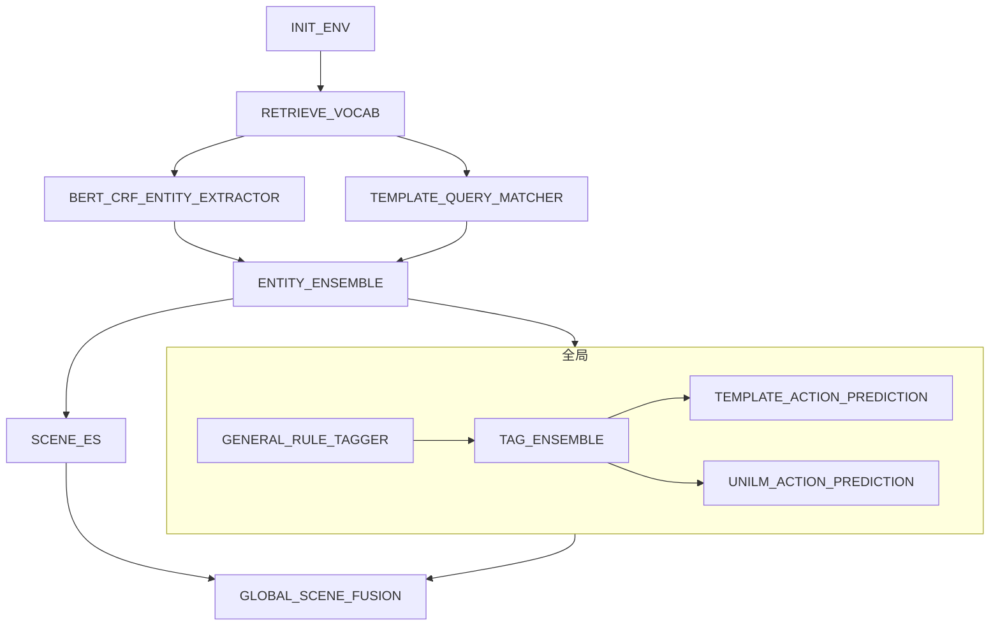

# 1.simple workflow



## template json

```json
{
  "name": "工作流",
  "sequentialSteps": [
    {
      "name": "初始化操作",
      "component": "INIT_ENV"
    },
    {
      "name": "获取词汇表",
      "component": "RETRIEVE_VOCAB"
    },
    {
      "name": "并行执行",
      "parallelSteps": [
        {
          "component": "BERT_CRF_ENTITY_EXTRACTOR"
        },
        {
          "component": "TEMPLATE_QUERY_MATCHER"
        }
      ]
    },
    {
      "name": "实体集成",
      "component": "ENTITY_ENSEMBLE"
    },
    {
      "name": "并行执行全局节点和可见及可说节点",
      "parallelSteps": [
        {
          "name": "全局节点",
          "sequentialSteps": [
            {
              "name": "初始化操作",
              "component": "GENERAL_RULE_TAGGER"
            },
            {
              "name": "标签集成",
              "component": "TAG_ENSEMBLE"
            },
            {
              "name": "并行执行预测",
              "parallelSteps": [
                {
                  "component": "TEMPLATE_ACTION_PREDICTION"
                },
                {
                  "component": "UNILM_ACTION_PREDICTION"
                }
              ]
            }
          ]
        },
        {
          "name": "场景ES",
          "component": "SCENE_ES"
        }
      ]
    },
    {
      "name": "全局场景融合",
      "component": "GLOBAL_SCENE_FUSION"
    }
  ]
}
```

## UT
``` shell
mvn clean test -D test=com.xiaopeng.workflow.HelloEasyFlowBpmnApplicationTests#testConvertXPComp -e

 WARNING: If a serviceability tool is in use, please run with -XX:+EnableDynamicAgentLoading to hide this warning
WARNING: If a serviceability tool is not in use, please run with -Djdk.instrument.traceUsage for more information
WARNING: Dynamic loading of agents will be disallowed by default in a future release
18:17:49.124 [main] INFO   - build sequential component:{"name":"工作流","sequentialSteps":[{"name":"初始化操作","component":"INIT_ENV","type":"single"},{"name":"获取词汇表","compnt":"RETRIEVE_VOCAB","type":"single"},{"name":"并行执行","parallelSteps":[{"component":"BERT_CRF_ENTITY_EXTRACTOR","type":"single"},{"component":"TEMPLATE_QUERY_MATCHER","type":"single"}],"type":"parallel"},{"name":"实体集成","component":"ENTITY_ENSEMBLE","type":"single"},{"name":"并行执行全局节点和可见及可说节点","parallelSteps":[{"name":"全局节点","sequentialSteps":[{"name":"初始化操作","component":"GENERAL_RULE_TAGGER","type":"single"},{"name":"标签集成","component":"TAG_ENSEMBLE","type":"single"},{"name":"并行执行预测","paralles":[{"component":"TEMPLATE_ACTION_PREDICTION","type":"single"},{"component":"UNILM_ACTION_PREDICTION","type":"single"}],"type":"parallel"}],"type":"sequential"},{"name":"场景ES","mponent":"SCENE_ES","type":"single"}],"type":"parallel"},{"name":"全局场景融合","component":"GLOBAL_SCENE_FUSION","type":"single"}],"type":"sequential"}
18:17:49.126 [main] INFO   - build single component:INIT_ENV
18:17:49.126 [main] INFO   - build single component:RETRIEVE_VOCAB
18:17:49.126 [main] INFO   - build parallel component:{"name":"并行执行","parallelSteps":[{"component":"BERT_CRF_ENTITY_EXTRACTOR","type":"single"},{"component":"TEMPLATE_QUERY_MATCHER","type":"single"}],"type":"parallel"}
18:17:49.127 [main] INFO   - build single component:BERT_CRF_ENTITY_EXTRACTOR
18:17:49.127 [main] INFO   - build single component:TEMPLATE_QUERY_MATCHER
18:17:49.129 [main] INFO   - build single component:ENTITY_ENSEMBLE
18:17:49.130 [main] INFO   - build parallel component:{"name":"并行执行全局节点和可见及可说节点","parallelSteps":[{"name":"全局节点","sequentialSteps":[{"name":"初始化操作","compot":"GENERAL_RULE_TAGGER","type":"single"},{"name":"标签集成","component":"TAG_ENSEMBLE","type":"single"},{"name":"并行执行预测","parallelSteps":[{"component":"TEMPLATE_ACTION_PREDICTION","type":"single"},{"component":"UNILM_ACTION_PREDICTION","type":"single"}],"type":"parallel"}],"type":"sequential"},{"name":"场景ES","component":"SCENE_ES","type":"single"}],"type":"parallel"}
18:17:49.130 [main] INFO   - build sequential component:{"name":"全局节点","sequentialSteps":[{"name":"初始化操作","component":"GENERAL_RULE_TAGGER","type":"single"},{"name":"标签","component":"TAG_ENSEMBLE","type":"single"},{"name":"并行执行预测","parallelSteps":[{"component":"TEMPLATE_ACTION_PREDICTION","type":"single"},{"component":"UNILM_ACTION_PREDICTION","type":"single"}],"type":"parallel"}],"type":"sequential"}
18:17:49.131 [main] INFO   - build single component:GENERAL_RULE_TAGGER
18:17:49.131 [main] INFO   - build single component:TAG_ENSEMBLE
18:17:49.131 [main] INFO   - build parallel component:{"name":"并行执行预测","parallelSteps":[{"component":"TEMPLATE_ACTION_PREDICTION","type":"single"},{"component":"UNILM_ACTION_PREDICTION","type":"single"}],"type":"parallel"}
18:17:49.131 [main] INFO   - build single component:TEMPLATE_ACTION_PREDICTION
18:17:49.131 [main] INFO   - build single component:UNILM_ACTION_PREDICTION
18:17:49.132 [main] INFO   - build single component:SCENE_ES
18:17:49.133 [main] INFO   - build single component:GLOBAL_SCENE_FUSION
18:17:49.133 [main] INFO   - Running workflow ''6c68911e-599e-4858-bc90-2418ae6e2568''
18:17:49.133 [main] INFO   - INIT_ENV execute start
18:17:51.057 [main] INFO   - INIT_ENV execute end ==> cost time:1920ms
18:17:51.059 [main] INFO   - RETRIEVE_VOCAB execute start
18:17:52.261 [main] INFO   - RETRIEVE_VOCAB execute end ==> cost time:1201ms
18:17:52.265 [pool-2-thread-1] INFO   - BERT_CRF_ENTITY_EXTRACTOR execute start
18:17:52.265 [pool-2-thread-2] INFO   - TEMPLATE_QUERY_MATCHER execute start
18:17:56.732 [pool-2-thread-2] INFO   - TEMPLATE_QUERY_MATCHER execute end ==> cost time:4463ms
18:17:57.178 [pool-2-thread-1] INFO   - BERT_CRF_ENTITY_EXTRACTOR execute end ==> cost time:4910ms
18:17:57.179 [main] INFO   - ENTITY_ENSEMBLE execute start
18:17:59.012 [main] INFO   - ENTITY_ENSEMBLE execute end ==> cost time:1829ms
18:17:59.013 [pool-2-thread-3] INFO   - GENERAL_RULE_TAGGER execute start
18:17:59.013 [pool-2-thread-4] INFO   - SCENE_ES execute start
18:17:59.334 [pool-2-thread-4] INFO   - SCENE_ES execute end ==> cost time:317ms
18:17:59.915 [pool-2-thread-3] INFO   - GENERAL_RULE_TAGGER execute end ==> cost time:897ms
18:17:59.915 [pool-2-thread-3] INFO   - TAG_ENSEMBLE execute start
18:18:01.681 [pool-2-thread-3] INFO   - TAG_ENSEMBLE execute end ==> cost time:1761ms
18:18:01.682 [pool-2-thread-5] INFO   - TEMPLATE_ACTION_PREDICTION execute start
18:18:01.683 [pool-2-thread-6] INFO   - UNILM_ACTION_PREDICTION execute start
18:18:03.554 [pool-2-thread-6] INFO   - UNILM_ACTION_PREDICTION execute end ==> cost time:1870ms
18:18:04.594 [pool-2-thread-5] INFO   - TEMPLATE_ACTION_PREDICTION execute end ==> cost time:2908ms
18:18:04.595 [main] INFO   - globalSceneFusion execute start
18:18:06.042 [main] INFO   - GLOBAL_SCENE_FUSION execute end ==> cost time:1443ms
18:18:06.043 [main] INFO   - report:DefaultWorkReport {status=COMPLETED, context=context={}}, error=''}


```