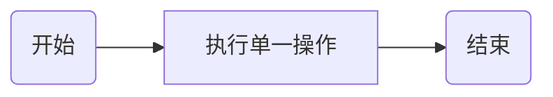
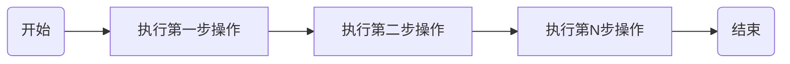
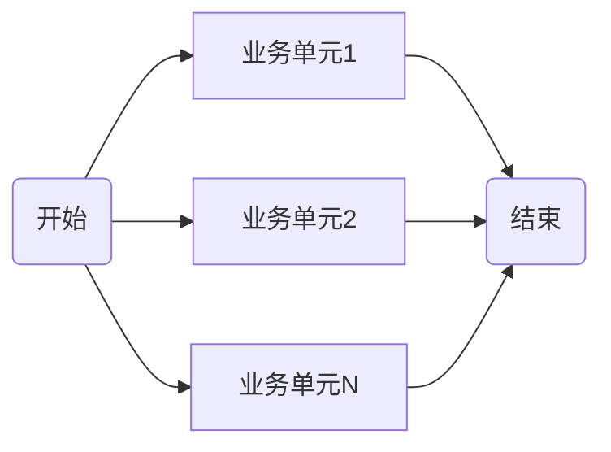
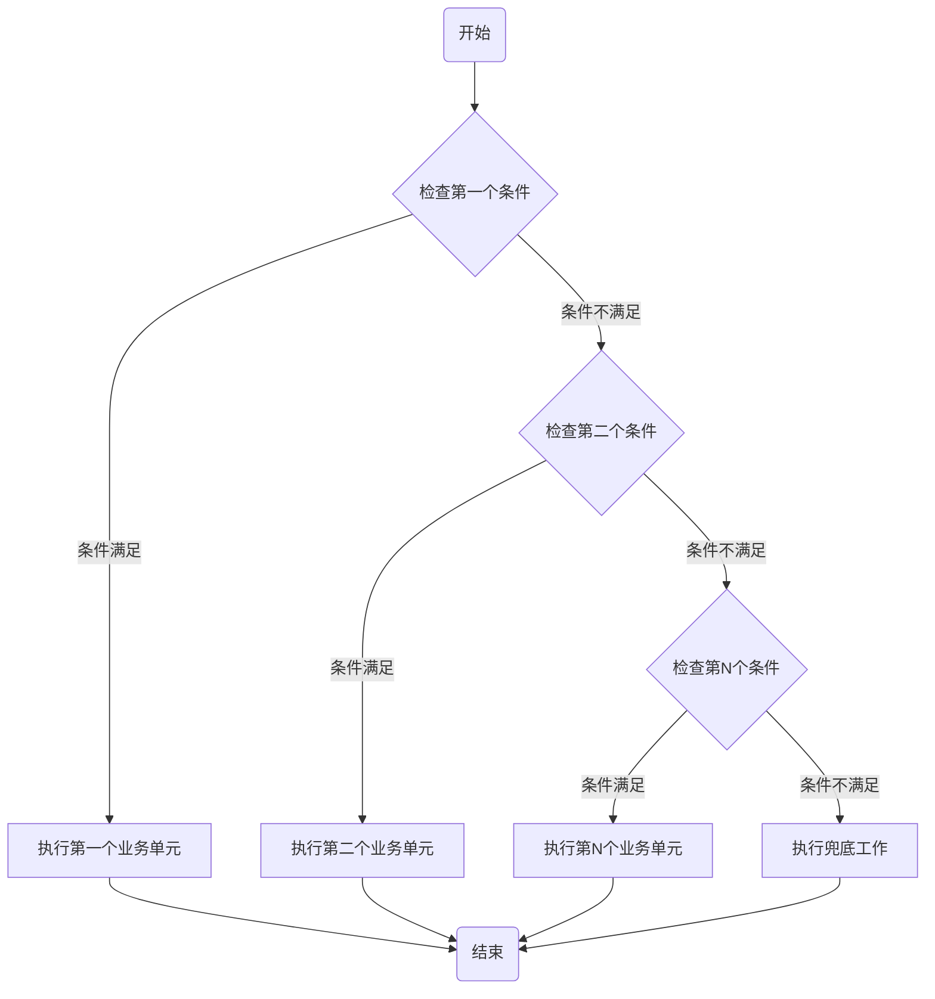
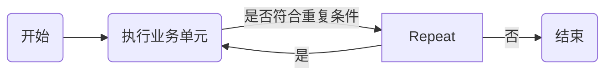
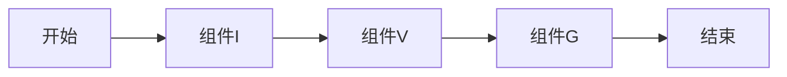
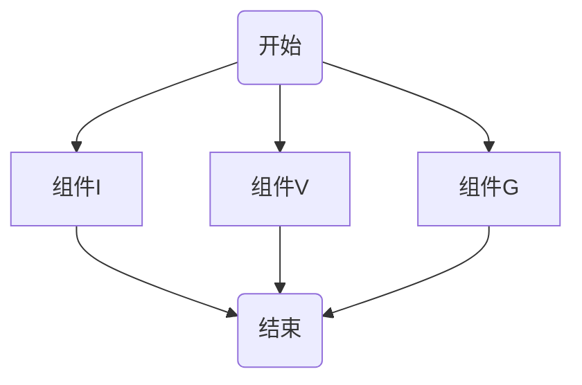
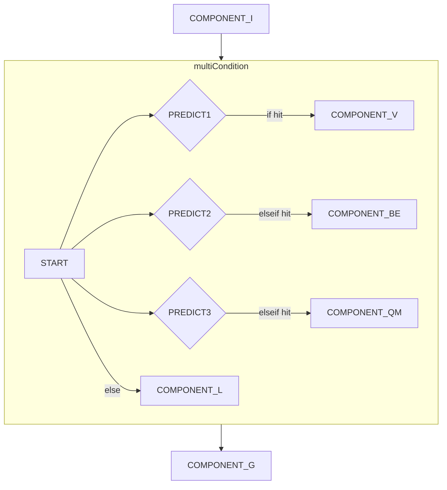
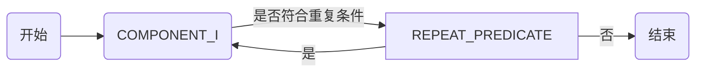
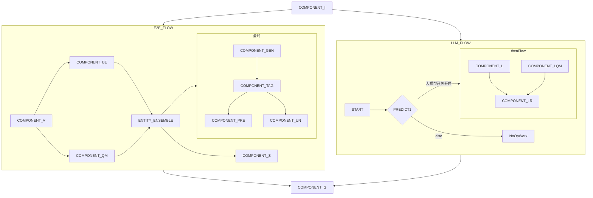

# XPComponentStep 类文档说明

## 概述

`XPComponentStep` 类是 `com.xiaopeng.workflow.components` 包的一部分。它代表工作流中的一个步骤，可以是以下几种类型：单一(
single)、顺序(sequential)、并行(parallel)、条件(conditional)、重复(repeat)。

## 类型解析

### 单一(single)

单一类型的步骤表示在工作流中只执行一个操作。在 `XPComponentStep` 中，如果 `type` 字段为 "single"，则表示此步骤是单一操作。
该类型为工作流中最原子单元，不包含其他操作。



### 顺序(sequential)

顺序类型的步骤表示在工作流中按照一定的顺序执行一系列的操作。在 `XPComponentStep` 中，如果 `type` 字段为 "sequential"
，则 `sequentialSteps` 字段会包含一个 `XPComponentStep` 对象的列表，表示顺序执行的步骤。
以下示例中第一步、第二步、第N步操作都可能为其他类型工作流组合成的业务单元。



### 并行(parallel)

并行类型的步骤表示在工作流中同时执行多个操作。在 `XPComponentStep` 中，如果 `type` 字段为 "parallel"，则 `parallelSteps`
字段会包含一个 `XPComponentStep` 对象的列表，表示并行执行的步骤。



### 条件(conditional)

条件类型的步骤表示在工作流中根据一定的条件选择执行不同的操作。在 `XPComponentStep` 中，如果 `type` 字段为 "conditional"
，则 `conditionSteps` 字段会包含一个 `XPConditionStep` 对象的列表，表示条件执行的步骤。
因原始 `org.jeasy.flows.workflow.ConditionalFlow`
未提供多条件实现，现重新定义多条件条件流，详情请看`com.xiaopeng.workflow.components.base.MulitConditionalFlow`。



### 重复(repeat)

重复类型的步骤表示在工作流中重复执行一个操作。类似 do while形式，该类型，先执行业务单元，再判断是否继续repeat.
在 `XPComponentStep` 中，如果 `type` 字段为 "repeat"，则 `repeatStep`
字段会包含一个 `XPRepeatStep` 对象，表示重复执行的步骤。



# XPWorkFLowBuilder 类文档

## 概述

`XPWorkFLowBuilder` 类是 `com.xiaopeng.workflow.components` 包的一部分。它用于构建工作流，根据 `XPComponentStep`
的类型，选择不同的解析器进行解析。
XPWorkFLowBuilder 类为流程解析的总入口类，它会根据传入的 `XPComponentStep`
对象，选择不同的解析器进行解析。具体解析请看`com.xiaopeng.workflow.components.parser` 包下的相关实现。

# 使用示例

## 1. 顺序流

首先，我们需要创建一个简单的顺序流工作流。在这个例子中，我们将创建一个包含三个步骤的顺序流：初始化操作，获取词汇表，全局场景融合。每个步骤都由一个组件来执行。

以下是JSON字符串表示的工作流：

```json
{
  "name": "顺序流示例",
  "type": "sequential",
  "sequentialSteps": [
    {
      "name": "组件I",
      "component": "COMPONENT_I"
    },
    {
      "name": "组件V",
      "component": "COMPONENT_V"
    },
    {
      "name": "组件G",
      "component": "COMPONENT_G"
    }
  ]
}
```

对应流程图如下：



这个流程图表示了工作流的执行顺序：首先执行初始化操作，然后获取词汇表，最后进行全局场景融合。

## UT

```shell
mvn clean test -D test=com.xiaopeng.workflow.HelloEasyFlowBpmnApplicationTests#testSimpleSequential -e

11:10:22.189 [main] INFO   - jsonStr:{"name":"顺序流示例","type":"sequential","sequentialSteps":[{"name":"组件I","component":"COMPONENT_I"},{"name":"组件V","component":"COMPONENT_V"},{"name":"组件G","component":"COMPONENT_G"}]}
11:10:22.276 [main] INFO   - ===================> sequential xD64rxve build start <====================
11:10:22.276 [main] INFO   - build single component:COMPONENT_I
11:10:22.276 [main] INFO   - build single component:COMPONENT_V
11:10:22.276 [main] INFO   - build single component:COMPONENT_G
11:10:22.283 [main] INFO   - ===================> sequential xD64rxve flow build success, component info  ==> {"name":"顺序流示例","type":"sequential","sequentialSteps":[{"name":"组件I","component":"COMPONENT_I","type":"single"},{"name":"组件V","component":"COMPONENT_V","type":"single"},{"name":"组件G","component":"COMPONENT_G","type":"single"}]} <===
11:10:22.289 [main] INFO   - Running workflow ''顺序流示例''
11:10:22.289 [main] INFO   - COMPONENT_I execute start
11:10:23.362 [main] INFO   - COMPONENT_I execute end ==> cost time:1068ms
11:10:23.364 [main] INFO   - COMPONENT_V execute start
11:10:28.358 [main] INFO   - COMPONENT_V execute end ==> cost time:4989ms
11:10:28.358 [main] INFO   - COMPONENT_G execute start
11:10:28.412 [main] INFO   - COMPONENT_G execute end ==> cost time:51ms
11:10:28.414 [main] INFO   - report:{"status":"COMPLETED","workContext":{}}
```

## 2. 简单并行流

首先，我们需要创建一个简单的并行流工作流。在这个例子中，我们将创建一个包含三个步骤的并行流：初始化操作，获取词汇表，全局场景融合。每个步骤都由一个组件来执行，但是这些步骤会并行执行。

以下是JSON字符串表示的工作流：

```json
{
  "name": "并行流示例",
  "type": "parallel",
  "parallelSteps": [
    {
      "name": "组件I",
      "component": "COMPONENT_I"
    },
    {
      "name": "组件V",
      "component": "COMPONENT_V"
    },
    {
      "name": "组件G",
      "component": "COMPONENT_G"
    }
  ]
}
```

对应流程图如下：



这个流程图表示了工作流的执行顺序：初始化操作，获取词汇表，全局场景融合这三个步骤会并行执行。

## UT

```shell
mvn clean test -D test=com.xiaopeng.workflow.HelloEasyFlowBpmnApplicationTests#testSimpleParallel -e

11:11:44.830 [main] INFO   - jsonStr:{"name":"并行流示例","type":"parallel","parallelSteps":[{"name":"组件I","component":"COMPONENT_I"},{"name":"组件V","component":"COMPONENT_V"},{"name":"组件G","component":"COMPONENT_G"}]}
11:11:44.961 [main] INFO   - ===================> parallel yIERMdUY build start <====================
11:11:44.962 [main] INFO   - build single component:COMPONENT_I
11:11:44.962 [main] INFO   - build single component:COMPONENT_V
11:11:44.962 [main] INFO   - build single component:COMPONENT_G
11:11:44.970 [main] INFO   - ===================> parallel yIERMdUY flow build success, component info  ==> {"name":"并行流示例","type":"parallel","parallelSteps":[{"name":"组件I","component":"COMPONENT_I","type":"single"},{"name":"组件V","component":"COMPONENT_V","type":"single"},{"name":"组件G","component":"COMPONENT_G","type":"single"}]} <===
11:11:44.979 [main] INFO   - Running workflow ''并行流示例''
11:11:44.981 [pool-2-thread-1] INFO   - COMPONENT_I execute start
11:11:44.982 [pool-2-thread-2] INFO   - COMPONENT_V execute start
11:11:44.983 [pool-2-thread-3] INFO   - COMPONENT_G execute start
11:11:45.924 [pool-2-thread-1] INFO   - COMPONENT_I execute end ==> cost time:938ms
11:11:46.646 [pool-2-thread-3] INFO   - COMPONENT_G execute end ==> cost time:1659ms
11:11:48.849 [pool-2-thread-2] INFO   - COMPONENT_V execute end ==> cost time:3861ms
11:11:48.852 [main] INFO   - report:{"reports":[{"status":"COMPLETED","workContext":{}},{"status":"COMPLETED","workContext":{}},{"status":"COMPLETED","workContext":{}}]}

```

## 3.多条件流

首先，我们需要创建一个多条件流工作流。在这个例子中，我们将创建一个包含三个个条件的多条件流：条件1和条件2
以下为JSON字符串表示的工作流：

```json
{
  "name": "条件判断工作流示例",
  "type": "sequential",
  "sequentialSteps": [
    {
      "name": "COMPONENT_I",
      "component": "COMPONENT_I"
    },
    {
      "name": "多条件流",
      "type": "conditional",
      "conditionSteps": [
        {
          "predicateClassName": "com.xiaopeng.workflow.components.predict.MulitPredicate.IF_COMPONENT_V_CASE",
          "componentStep": {
            "name": "COMPONENT_V",
            "component": "COMPONENT_V"
          }
        },
        {
          "predicateClassName": "com.xiaopeng.workflow.components.predict.MulitPredicate.IF_COMPONENT_BE_CASE",
          "componentStep": {
            "name": "COMPONENT_BE",
            "component": "COMPONENT_BE"
          }
        },
        {
          "predicateClassName": "com.xiaopeng.workflow.components.predict.MulitPredicate.IF_COMPONENT_QM_CASE",
          "componentStep": {
            "name": "COMPONENT_QM",
            "component": "COMPONENT_QM"
          }
        },
        {
          "conditionStep": 2,
          "componentStep": {
            "name": "COMPONENT_L",
            "component": "COMPONENT_L"
          }
        }
      ]
    },
    {
      "name": "COMPONENT_G",
      "component": "COMPONENT_G"
    }
  ]
}
```   

对应流程图如下：



UT

```shell
mvn clean test -D test=com.xiaopeng.workflow.HelloEasyFlowBpmnApplicationTests#testSimpleMulitCondition -e


11:14:06.354 [main] INFO   - jsonStr:{"name":"条件判断工作流示例","type":"sequential","sequentialSteps":[{"name":"COMPONENT_I","component":"COMPONENT_I"},{"name":"多条件流","type":"conditional","conditionSteps":[{"predicateClassName":"com.xiaopeng.workflow.components.predict.MulitPredicate.IF_COMPONENT_V_CASE","componentStep":{"name":"COMPONENT_V","component":"COMPONENT_V"}},{"predicateClassName":"com.xiaopeng.workflow.components.predict.MulitPredicate.IF_COMPONENT_BE_CASE","componentStep":{"name":"COMPONENT_BE","component":"COMPONENT_BE"}},{"predicateClassName":"com.xiaopeng.workflow.components.predict.MulitPredicate.IF_COMPONENT_QM_CASE","componentStep":{"name":"COMPONENT_QM","component":"COMPONENT_QM"}},{"conditionStep":2,"componentStep":{"name":"COMPONENT_L","component":"COMPONENT_L"}}]},{"name":"COMPONENT_G","component":"COMPONENT_G"}]}
11:14:06.447 [main] INFO   - ===================> sequential IlJEQoki build start <====================
11:14:06.448 [main] INFO   - build single component:COMPONENT_I
11:14:06.448 [main] INFO   - ===================> conditional B1RmTlD3 build start <====================
11:14:06.449 [main] INFO   - build single component:COMPONENT_V
11:14:06.456 [main] INFO   - build single component:COMPONENT_BE
11:14:06.457 [main] INFO   - build single component:COMPONENT_QM
11:14:06.458 [main] INFO   - build single component:COMPONENT_L
11:14:06.468 [main] INFO   - ===================> conditional B1RmTlD3 flow build success, component info  ==> {"name":"多条件流","type":"conditional","conditionSteps":[{"conditionStep":1,"predicateClassName":"com.xiaopeng.workflow.components.predict.MulitPredicate.IF_COMPONENT_V_CASE","componentStep":{"name":"COMPONENT_V","component":"COMPONENT_V","type":"single"}},{"conditionStep":1,"predicateClassName":"com.xiaopeng.workflow.components.predict.MulitPredicate.IF_COMPONENT_BE_CASE","componentStep":{"name":"COMPONENT_BE","component":"COMPONENT_BE","type":"single"}},{"conditionStep":1,"predicateClassName":"com.xiaopeng.workflow.components.predict.MulitPredicate.IF_COMPONENT_QM_CASE","componentStep":{"name":"COMPONENT_QM","component":"COMPONENT_QM","type":"single"}},{"conditionStep":2,"componentStep":{"name":"COMPONENT_L","component":"COMPONENT_L","type":"single"}}]} <===
11:14:06.468 [main] INFO   - build single component:COMPONENT_G
11:14:06.470 [main] INFO   - ===================> sequential IlJEQoki flow build success, component info  ==> {"name":"条件判断工作流示例","type":"sequential","sequentialSteps":[{"name":"COMPONENT_I","component":"COMPONENT_I","type":"single"},{"name":"多条件流","type":"conditional","conditionSteps":[{"conditionStep":1,"predicateClassName":"com.xiaopeng.workflow.components.predict.MulitPredicate.IF_COMPONENT_V_CASE","componentStep":{"name":"COMPONENT_V","component":"COMPONENT_V","type":"single"}},{"conditionStep":1,"predicateClassName":"com.xiaopeng.workflow.components.predict.MulitPredicate.IF_COMPONENT_BE_CASE","componentStep":{"name":"COMPONENT_BE","component":"COMPONENT_BE","type":"single"}},{"conditionStep":1,"predicateClassName":"com.xiaopeng.workflow.components.predict.MulitPredicate.IF_COMPONENT_QM_CASE","componentStep":{"name":"COMPONENT_QM","component":"COMPONENT_QM","type":"single"}},{"conditionStep":2,"componentStep":{"name":"COMPONENT_L","component":"COMPONENT_L","type":"single"}}]},{"name":"COMPONENT_G","component":"COMPONENT_G","type":"single"}]} <===
11:14:06.476 [main] INFO   - Running workflow ''条件判断工作流示例''
11:14:06.477 [main] INFO   - COMPONENT_I execute start
11:14:09.786 [main] INFO   - COMPONENT_I execute end ==> cost time:3303ms
11:14:09.787 [main] INFO   - IF_COMPONENT_V_CASE judge 是否命中分支条件 ==> false
11:14:09.787 [main] INFO   - IF_COMPONENT_BE_CASE judge 是否命中分支条件 ==> false
11:14:09.787 [main] INFO   - IF_COMPONENT_QM_CASE judge 是否命中分支条件 ==> false
11:14:09.787 [main] INFO   - COMPONENT_L execute start
11:14:12.952 [main] INFO   - COMPONENT_L execute end ==> cost time:3161ms
11:14:12.953 [main] INFO   - COMPONENT_G execute start
11:14:17.157 [main] INFO   - COMPONENT_G execute end ==> cost time:4201ms
11:14:17.158 [main] INFO   - report:{"status":"COMPLETED","workContext":{}}
```

## 4.重复流

首先，我们需要创建一个重复流工作流。在这个例子中，我们将创建一个包含一个重复流的工作流：重复单元为初始化操作单元。这个步骤步骤会重复执行3次。

以下是JSON字符串表示的工作流：

```json
{
  "name": "repeat工作流示例",
  "type": "sequential",
  "sequentialSteps": [
    {
      "name": "重复3次",
      "type": "repeat",
      "repeatStep": {
        "predicateClassName": "com.xiaopeng.workflow.components.predict.MulitPredicate.REPEAT_PREDICATE",
        "componentStep": {
          "name": "COMPONENT_I",
          "component": "COMPONENT_I"
        }
      }
    }
  ]
}
```

对应流程图如下：



```shell
mvn clean test -D test=com.xiaopeng.workflow.HelloEasyFlowBpmnApplicationTests#testSimpleRepeatCase -e

11:17:18.421 [main] INFO   - jsonStr:{"name":"repeat工作流示例","type":"sequential","sequentialSteps":[{"name":"重复3次","type":"repeat","repeatStep":{"predicateClassName":"com.xiaopeng.workflow.components.predict.MulitPredicate.REPEAT_PREDICATE","componentStep":{"name":"COMPONENT_I","component":"COMPONENT_I"}}}]}
11:17:18.487 [main] INFO   - ===================> sequential 8KQLrQgW build start <====================
11:17:18.487 [main] INFO   - ===================> repeat iMC7vjt7 build start <====================
11:17:18.492 [main] INFO   - build single component:COMPONENT_I
11:17:18.501 [main] INFO   - ===================> repeat iMC7vjt7 flow build success, component info  ==> {"name":"重复3次","type":"repeat","repeatStep":{"predicateClassName":"com.xiaopeng.workflow.components.predict.MulitPredicate.REPEAT_PREDICATE","componentStep":{"name":"COMPONENT_I","component":"COMPONENT_I","type":"single"}}} <===
11:17:18.507 [main] INFO   - ===================> sequential 8KQLrQgW flow build success, component info  ==> {"name":"repeat工作流示例","type":"sequential","sequentialSteps":[{"name":"重复3次","type":"repeat","repeatStep":{"predicateClassName":"com.xiaopeng.workflow.components.predict.MulitPredicate.REPEAT_PREDICATE","componentStep":{"name":"COMPONENT_I","component":"COMPONENT_I","type":"single"}}}]} <===
11:17:18.509 [main] INFO   - Running workflow ''repeat工作流示例''
11:17:18.509 [main] INFO   - COMPONENT_I execute start
11:17:19.789 [main] INFO   - COMPONENT_I execute end ==> cost time:1276ms
11:17:19.790 [main] INFO   - repeat 次数 1
11:17:19.791 [main] INFO   - COMPONENT_I execute start
11:17:21.487 [main] INFO   - COMPONENT_I execute end ==> cost time:1691ms
11:17:21.487 [main] INFO   - repeat 次数 2
11:17:21.488 [main] INFO   - COMPONENT_I execute start
11:17:22.181 [main] INFO   - COMPONENT_I execute end ==> cost time:690ms
11:17:22.182 [main] INFO   - repeat 次数 3
11:17:22.183 [main] INFO   - report:{"status":"COMPLETED","workContext":{}}
```


## 复杂流程示例

### json 结构示例
```json
{
  "name": "复杂工作流示例",
  "type": "sequential",
  "sequentialSteps": [
    {
      "name": "COMPONENT_I",
      "component": "COMPONENT_I"
    },
    {
      "name": "e2e and COMPONENT_L flow",
      "type": "parallel",
      "parallelSteps": [
        {
          "name": "e2e-flow",
          "type": "sequential",
          "sequentialSteps": [
            {
              "name": "COMPONENT_V",
              "component": "COMPONENT_V"
            },
            {
              "name": "并行执行",
              "type": "parallel",
              "parallelSteps": [
                {
                  "component": "COMPONENT_BE"
                },
                {
                  "component": "COMPONENT_QM"
                }
              ]
            },
            {
              "name": "实体集成",
              "component": "ENTITY_ENSEMBLE"
            },
            {
              "name": "并行执行 全局节点 & COMPONENT_S 节点",
              "type": "parallel",
              "parallelSteps": [
                {
                  "name": "全局节点",
                  "type": "sequential",
                  "sequentialSteps": [
                    {
                      "name": "初始化操作",
                      "component": "COMPONENT_GEN"
                    },
                    {
                      "name": "标签集成",
                      "component": "COMPONENT_TAG"
                    },
                    {
                      "name": "并行执行预测",
                      "type": "parallel",
                      "parallelSteps": [
                        {
                          "component": "COMPONENT_PRE"
                        },
                        {
                          "component": "COMPONENT_UN"
                        }
                      ]
                    }
                  ]
                },
                {
                  "name": "COMPONENT_S",
                  "component": "COMPONENT_S"
                }
              ]
            }
          ]
        },
        {
          "name": "L链路",
          "type": "conditional",
          "conditionSteps": [
            {
              "predicateClassName": "com.xiaopeng.workflow.components.predict.XGPTSwitchPredicate",
              "componentStep": {
                "type": "sequential",
                "name": "thenWorkFlow",
                "sequentialSteps": [
                  {
                    "name": "thenWorkFlow",
                    "type": "sequential",
                    "conditionStep": 1,
                    "sequentialSteps": [
                      {
                        "name": "COMPONENT_LParael",
                        "type": "parallel",
                        "parallelSteps": [
                          {
                            "name": "COMPONENT_L",
                            "component": "COMPONENT_L"
                          },
                          {
                            "name": "COMPONENT_L_COMPONENT_QM",
                            "component": "COMPONENT_LQM"
                          }
                        ]
                      },
                      {
                        "name": "COMPONENT_LR",
                        "component": "COMPONENT_LR"
                      }
                    ]
                  }
                ]
              }
            }
          ]
        }
      ]
    },
    {
      "name": "COMPONENT_G",
      "component": "COMPONENT_G"
    }
  ]
}
```

### yml 结构示例
```yaml
name: 复杂工作流示例
type: sequential
sequentialSteps:
  - name: COMPONENT_I
    component: COMPONENT_I
  - name: e2e and COMPONENT_L flow
    type: parallel
    parallelSteps:
      - name: e2e-flow
        type: sequential
        sequentialSteps:
          - name: COMPONENT_V
            component: COMPONENT_V
          - name: 并行执行
            type: parallel
            parallelSteps:
              - component: COMPONENT_BE
              - component: COMPONENT_QM
          - name: 实体集成
            component: ENTITY_ENSEMBLE
          - name: 并行执行 全局节点 & COMPONENT_S 节点
            type: parallel
            parallelSteps:
              - name: 全局节点
                type: sequential
                sequentialSteps:
                  - name: 初始化操作
                    component: COMPONENT_GEN
                  - name: 标签集成
                    component: COMPONENT_TAG
                  - name: 并行执行预测
                    type: parallel
                    parallelSteps:
                      - component: COMPONENT_PRE
                      - component: COMPONENT_UN
              - name: COMPONENT_S
                component: COMPONENT_S
      - name: L链路
        type: conditional
        conditionSteps:
          - predicateClassName: com.xiaopeng.workflow.components.predict.XGPTSwitchPredicate
            componentStep:
              type: sequential
              name: thenWorkFlow
              sequentialSteps:
                - name: thenWorkFlow
                  type: sequential
                  conditionStep: 1
                  sequentialSteps:
                    - name: COMPONENT_LParael
                      type: parallel
                      parallelSteps:
                        - name: COMPONENT_L
                          component: COMPONENT_L
                        - name: COMPONENT_L_COMPONENT_QM
                          component: COMPONENT_LQM
                    - name: COMPONENT_LR
                      component: COMPONENT_LR
  - name: COMPONENT_G
    component: COMPONENT_G

```


## 流程图


## UT

```shell
mvn clean test -D test=com.xiaopeng.workflow.HelloEasyFlowBpmnApplicationTests#testComplexFlow -e

17:03:53.665 [main] INFO   - jsonStr:{"name":"复杂工作流示例","type":"sequential","sequentialSteps":[{"name":"初始化操作","component":"COMPONENT_I"},{"name":"e2e and llm flow","type":"parallel","parallelSteps":[{"name":"e2e-flow","type":"sequential","sequentialSteps":[{"name":"获取词汇表","component":"COMPONENT_V"},{"name":"并行执行","type":"parallel","parallelSteps":[{"component":"COMPONENT_BE"},{"component":"COMPONENT_QM"}]},{"name":"实体集成","component":"ENTITY_ENSEMBLE"},{"name":"并行执行全局节点和可见及可说节点","type":"parallel","parallelSteps":[{"name":"全局节点","type":"sequential","sequentialSteps":[{"name":"初始化操作","component":"COMPONENT_GEN"},{"name":"标签集成","component":"COMPONENT_TAG"},{"name":"并行执行预测","type":"parallel","parallelSteps":[{"component":"COMPONENT_PRE"},{"component":"COMPONENT_UN"}]}]},{"name":"场景ES","component":"COMPONENT_S"}]}]},{"name":"llm 链路","type":"conditional","conditionSteps":[{"predicateClassName":"com.xiaopeng.workflow.components.predict.XGPTSwitchPredicate","componentStep":{"type":"sequential","name":"thenWorkFlow","sequentialSteps":[{"name":"thenWorkFlow","type":"sequential","conditionStep":1,"sequentialSteps":[{"name":"llmParael","type":"parallel","parallelSteps":[{"name":"COMPONENT_L","component":"COMPONENT_L"},{"name":"COMPONENT_LQM","component":"COMPONENT_LQM"}]},{"name":"COMPONENT_LR","component":"COMPONENT_LR"}]}]}}]}]},{"name":"全局场景融合","component":"COMPONENT_G"}]}
17:03:53.759 [main] INFO   - ===================> sequential fV1vtF0l build start <====================
17:03:53.760 [main] INFO   - build single component:COMPONENT_I
17:03:53.760 [main] INFO   - ===================> parallel AFwTblRW build start <====================
17:03:53.760 [main] INFO   - ===================> sequential KqVNtx3Z build start <====================
17:03:53.760 [main] INFO   - build single component:COMPONENT_V
17:03:53.760 [main] INFO   - ===================> parallel MRVaL6Dw build start <====================
17:03:53.760 [main] INFO   - build single component:COMPONENT_BE
17:03:53.760 [main] INFO   - build single component:COMPONENT_QM
17:03:53.765 [main] INFO   - ===================> parallel MRVaL6Dw flow build success, component info  ==> {"name":"并行执行","type":"parallel","parallelSteps":[{"component":"COMPONENT_BE","type":"single"},{"component":"COMPONENT_QM","type":"single"}]} <===
17:03:53.771 [main] INFO   - build single component:ENTITY_ENSEMBLE
17:03:53.771 [main] INFO   - ===================> parallel 0AVqwXO4 build start <====================
17:03:53.771 [main] INFO   - ===================> sequential 7W3jkBzD build start <====================
17:03:53.771 [main] INFO   - build single component:COMPONENT_GEN
17:03:53.771 [main] INFO   - build single component:COMPONENT_TAG
17:03:53.771 [main] INFO   - ===================> parallel 6Co6BAWJ build start <====================
17:03:53.771 [main] INFO   - build single component:COMPONENT_PRE
17:03:53.771 [main] INFO   - build single component:COMPONENT_UN
17:03:53.772 [main] INFO   - ===================> parallel 6Co6BAWJ flow build success, component info  ==> {"name":"并行执行预测","type":"parallel","parallelSteps":[{"component":"COMPONENT_PRE","type":"single"},{"component":"COMPONENT_UN","type":"single"}]} <===
17:03:53.773 [main] INFO   - ===================> sequential 7W3jkBzD flow build success, component info  ==> {"name":"全局节点","type":"sequential","sequentialSteps":[{"name":"初始化操作","component":"COMPONENT_GEN","type":"single"},{"name":"标签集成","component":"COMPONENT_TAG","type":"single"},{"name":"并行执行预测","type":"parallel","parallelSteps":[{"component":"COMPONENT_PRE","type":"single"},{"component":"COMPONENT_UN","type":"single"}]}]} <===
17:03:53.775 [main] INFO   - build single component:COMPONENT_S
17:03:53.777 [main] INFO   - ===================> parallel 0AVqwXO4 flow build success, component info  ==> {"name":"并行执行全局节点和可见及可说节点","type":"parallel","parallelSteps":[{"name":"全局节点","type":"sequential","sequentialSteps":[{"name":"初始化操作","component":"COMPONENT_GEN","type":"single"},{"name":"标签集成","component":"COMPONENT_TAG","type":"single"},{"name":"并行执行预测","type":"parallel","parallelSteps":[{"component":"COMPONENT_PRE","type":"single"},{"component":"COMPONENT_UN","type":"single"}]}]},{"name":"场景ES","component":"COMPONENT_S","type":"single"}]} <===
17:03:53.779 [main] INFO   - ===================> sequential KqVNtx3Z flow build success, component info  ==> {"name":"e2e-flow","type":"sequential","sequentialSteps":[{"name":"获取词汇表","component":"COMPONENT_V","type":"single"},{"name":"并行执行","type":"parallel","parallelSteps":[{"component":"COMPONENT_BE","type":"single"},{"component":"COMPONENT_QM","type":"single"}]},{"name":"实体集成","component":"ENTITY_ENSEMBLE","type":"single"},{"name":"并行执行全局节点和可见及可说节点","type":"parallel","parallelSteps":[{"name":"全局节点","type":"sequential","sequentialSteps":[{"name":"初始化操作","component":"COMPONENT_GEN","type":"single"},{"name":"标签集成","component":"COMPONENT_TAG","type":"single"},{"name":"并行执行预测","type":"parallel","parallelSteps":[{"component":"COMPONENT_PRE","type":"single"},{"component":"COMPONENT_UN","type":"single"}]}]},{"name":"场景ES","component":"COMPONENT_S","type":"single"}]}]} <===
17:03:53.780 [main] INFO   - ===================> conditional JzwMR2u6 build start <====================
17:03:53.781 [main] INFO   - ===================> sequential SxDRO7yz build start <====================
17:03:53.781 [main] INFO   - ===================> sequential jPiZxeuo build start <====================
17:03:53.781 [main] INFO   - ===================> parallel oAJdjghr build start <====================
17:03:53.781 [main] INFO   - build single component:COMPONENT_L
17:03:53.781 [main] INFO   - build single component:COMPONENT_LQM
17:03:53.782 [main] INFO   - ===================> parallel oAJdjghr flow build success, component info  ==> {"name":"llmParael","type":"parallel","parallelSteps":[{"name":"COMPONENT_L","component":"COMPONENT_L","type":"single"},{"name":"COMPONENT_LQM","component":"COMPONENT_LQM","type":"single"}]} <===
17:03:53.782 [main] INFO   - build single component:COMPONENT_LR
17:03:53.783 [main] INFO   - ===================> sequential jPiZxeuo flow build success, component info  ==> {"name":"thenWorkFlow","type":"sequential","sequentialSteps":[{"name":"llmParael","type":"parallel","parallelSteps":[{"name":"LLM","component":"LLM","type":"single"},{"name":"COMPONENT_LQM","component":"COMPONENT_LQM","type":"single"}]},{"name":"COMPONENT_LR","component":"COMPONENT_LR","type":"single"}]} <===
17:03:53.785 [main] INFO   - ===================> sequential SxDRO7yz flow build success, component info  ==> {"name":"thenWorkFlow","type":"sequential","sequentialSteps":[{"name":"thenWorkFlow","type":"sequential","sequentialSteps":[{"name":"llmParael","type":"parallel","parallelSteps":[{"name":"LLM","component":"LLM","type":"single"},{"name":"COMPONENT_LQM","component":"COMPONENT_LQM","type":"single"}]},{"name":"COMPONENT_LR","component":"COMPONENT_LR","type":"single"}]}]} <===
17:03:53.791 [main] INFO   - ===================> conditional JzwMR2u6 flow build success, component info  ==> {"name":"llm 链路","type":"conditional","conditionSteps":[{"conditionStep":1,"predicateClassName":"com.xiaopeng.workflow.components.predict.XGPTSwitchPredicate","componentStep":{"name":"thenWorkFlow","type":"sequential","sequentialSteps":[{"name":"thenWorkFlow","type":"sequential","sequentialSteps":[{"name":"llmParael","type":"parallel","parallelSteps":[{"name":"LLM","component":"LLM","type":"single"},{"name":"COMPONENT_LQM","component":"COMPONENT_LQM","type":"single"}]},{"name":"COMPONENT_LR","component":"COMPONENT_LR","type":"single"}]}]}}]} <===
17:03:53.793 [main] INFO   - ===================> parallel AFwTblRW flow build success, component info  ==> {"name":"e2e and llm flow","type":"parallel","parallelSteps":[{"name":"e2e-flow","type":"sequential","sequentialSteps":[{"name":"获取词汇表","component":"COMPONENT_V","type":"single"},{"name":"并行执行","type":"parallel","parallelSteps":[{"component":"COMPONENT_BE","type":"single"},{"component":"COMPONENT_QM","type":"single"}]},{"name":"实体集成","component":"ENTITY_ENSEMBLE","type":"single"},{"name":"并行执行全局节点和可见及可说节点","type":"parallel","parallelSteps":[{"name":"全局节点","type":"sequential","sequentialSteps":[{"name":"初始化操作","component":"COMPONENT_GEN","type":"single"},{"name":"标签集成","component":"COMPONENT_TAG","type":"single"},{"name":"并行执行预测","type":"parallel","parallelSteps":[{"component":"COMPONENT_PRE","type":"single"},{"component":"COMPONENT_UN","type":"single"}]}]},{"name":"场景ES","component":"COMPONENT_S","type":"single"}]}]},{"name":"llm 链路","type":"conditional","conditionSteps":[{"conditionStep":1,"predicateClassName":"com.xiaopeng.workflow.components.predict.XGPTSwitchPredicate","componentStep":{"name":"thenWorkFlow","type":"sequential","sequentialSteps":[{"name":"thenWorkFlow","type":"sequential","sequentialSteps":[{"name":"llmParael","type":"parallel","parallelSteps":[{"name":"LLM","component":"LLM","type":"single"},{"name":"COMPONENT_LQM","component":"COMPONENT_LQM","type":"single"}]},{"name":"COMPONENT_LR","component":"COMPONENT_LR","type":"single"}]}]}}]}]} <===
17:03:53.793 [main] INFO   - build single component:COMPONENT_G
17:03:53.795 [main] INFO   - ===================> sequential fV1vtF0l flow build success, component info  ==> {"name":"复杂工作流示例","type":"sequential","sequentialSteps":[{"name":"初始化操作","component":"COMPONENT_I","type":"single"},{"name":"e2e and llm flow","type":"parallel","parallelSteps":[{"name":"e2e-flow","type":"sequential","sequentialSteps":[{"name":"获取词汇表","component":"COMPONENT_V","type":"single"},{"name":"并行执行","type":"parallel","parallelSteps":[{"component":"COMPONENT_BE","type":"single"},{"component":"COMPONENT_QM","type":"single"}]},{"name":"实体集成","component":"ENTITY_ENSEMBLE","type":"single"},{"name":"并行执行全局节点和可见及可说节点","type":"parallel","parallelSteps":[{"name":"全局节点","type":"sequential","sequentialSteps":[{"name":"初始化操作","component":"COMPONENT_GEN","type":"single"},{"name":"标签集成","component":"COMPONENT_TAG","type":"single"},{"name":"并行执行预测","type":"parallel","parallelSteps":[{"component":"COMPONENT_PRE","type":"single"},{"component":"COMPONENT_UN","type":"single"}]}]},{"name":"场景ES","component":"COMPONENT_S","type":"single"}]}]},{"name":"llm 链路","type":"conditional","conditionSteps":[{"conditionStep":1,"predicateClassName":"com.xiaopeng.workflow.components.predict.XGPTSwitchPredicate","componentStep":{"name":"thenWorkFlow","type":"sequential","sequentialSteps":[{"name":"thenWorkFlow","type":"sequential","sequentialSteps":[{"name":"llmParael","type":"parallel","parallelSteps":[{"name":"LLM","component":"LLM","type":"single"},{"name":"COMPONENT_LQM","component":"COMPONENT_LQM","type":"single"}]},{"name":"COMPONENT_LR","component":"COMPONENT_LR","type":"single"}]}]}}]}]},{"name":"全局场景融合","component":"COMPONENT_G","type":"single"}]} <===
17:03:53.797 [main] INFO   - Running workflow ''复杂工作流示例''
17:03:53.797 [main] INFO   - COMPONENT_I execute start
17:03:58.655 [main] INFO   - COMPONENT_I execute end ==> cost time:4854ms
17:03:58.658 [pool-2-thread-1] INFO   - COMPONENT_V execute start
17:03:58.658 [pool-2-thread-2] INFO   - XGPTSwitchPredicate 大模型开关开启状态 ==> true
17:03:58.658 [pool-2-thread-3] INFO   - LLM execute start
17:03:58.658 [pool-2-thread-4] INFO   - COMPONENT_LQM execute start
17:03:58.662 [pool-2-thread-3] INFO   - LLM execute end ==> cost time:3ms
17:03:59.990 [pool-2-thread-4] INFO   - COMPONENT_LQM execute end ==> cost time:1328ms
17:03:59.991 [pool-2-thread-2] INFO   - COMPONENT_LR execute start
17:04:00.674 [pool-2-thread-2] INFO   - COMPONENT_LR execute end ==> cost time:679ms
17:04:03.109 [pool-2-thread-1] INFO   - COMPONENT_V execute end ==> cost time:4447ms
17:04:03.110 [pool-2-thread-5] INFO   - COMPONENT_BE execute start
17:04:03.111 [pool-2-thread-6] INFO   - COMPONENT_QM execute start
17:04:03.717 [pool-2-thread-6] INFO   - COMPONENT_QM execute end ==> cost time:602ms
17:04:04.102 [pool-2-thread-5] INFO   - COMPONENT_BE execute end ==> cost time:989ms
17:04:04.103 [pool-2-thread-1] INFO   - ENTITY_ENSEMBLE execute start
17:04:06.877 [pool-2-thread-1] INFO   - ENTITY_ENSEMBLE execute end ==> cost time:2771ms
17:04:06.877 [pool-2-thread-7] INFO   - COMPONENT_GEN execute start
17:04:06.877 [pool-2-thread-8] INFO   - COMPONENT_S execute start
17:04:07.692 [pool-2-thread-7] INFO   - COMPONENT_GEN execute end ==> cost time:813ms
17:04:07.692 [pool-2-thread-7] INFO   - COMPONENT_TAG execute start
17:04:10.517 [pool-2-thread-8] INFO   - COMPONENT_S execute end ==> cost time:3635ms
17:04:10.541 [pool-2-thread-7] INFO   - COMPONENT_TAG execute end ==> cost time:2846ms
17:04:10.542 [pool-2-thread-10] INFO   - COMPONENT_UN execute start
17:04:10.542 [pool-2-thread-9] INFO   - COMPONENT_PRE execute start
17:04:13.428 [pool-2-thread-9] INFO   - COMPONENT_PRE execute end ==> cost time:2880ms
17:04:15.498 [pool-2-thread-10] INFO   - COMPONENT_UN execute end ==> cost time:4952ms
17:04:15.499 [main] INFO   - COMPONENT_G execute start
17:04:19.166 [main] INFO   - COMPONENT_G execute end ==> cost time:3661ms
17:04:19.167 [main] INFO   - report:{"status":"COMPLETED","workContext":{}}
```