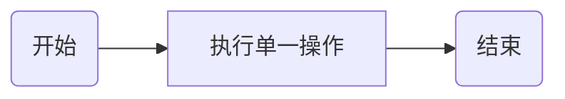
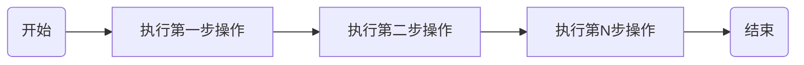
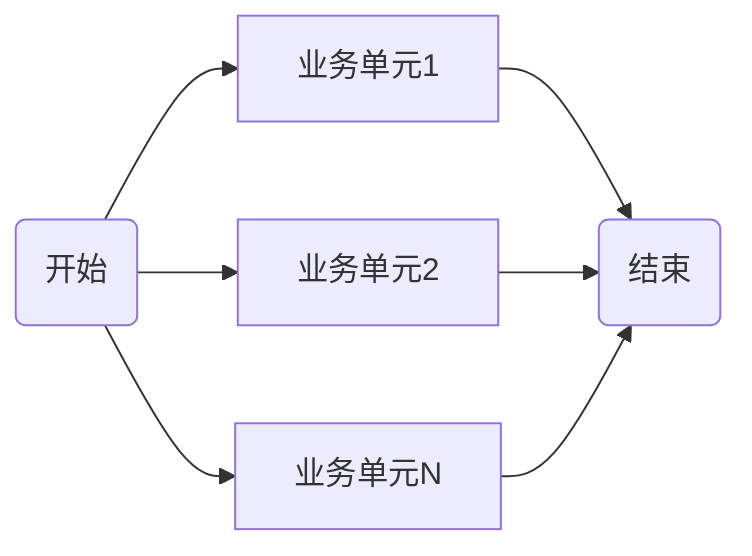
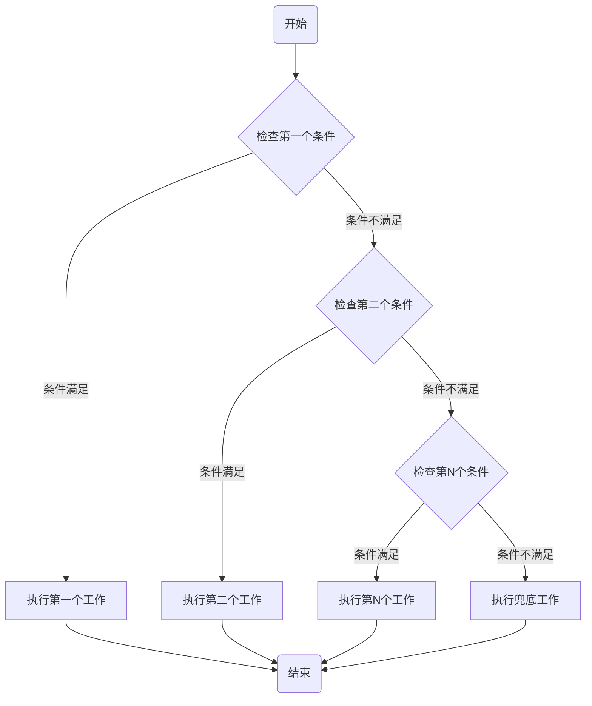
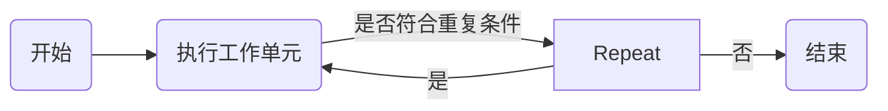
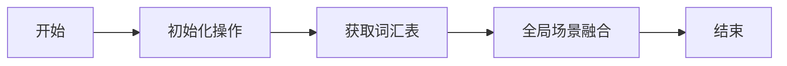
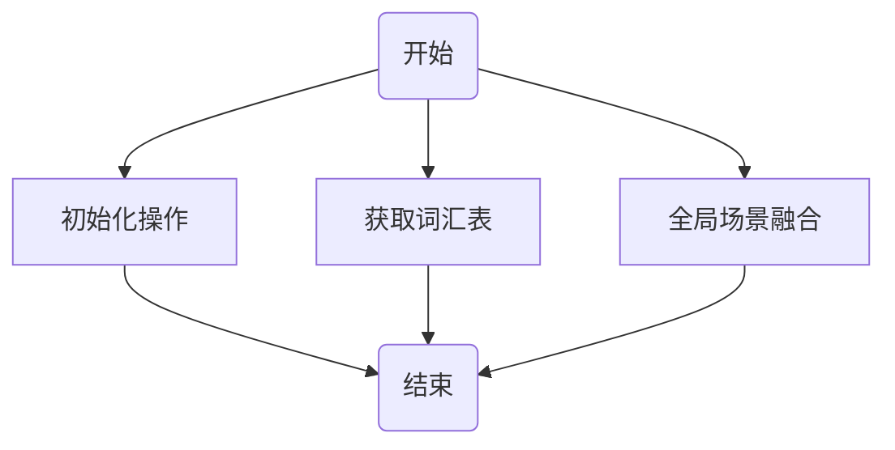
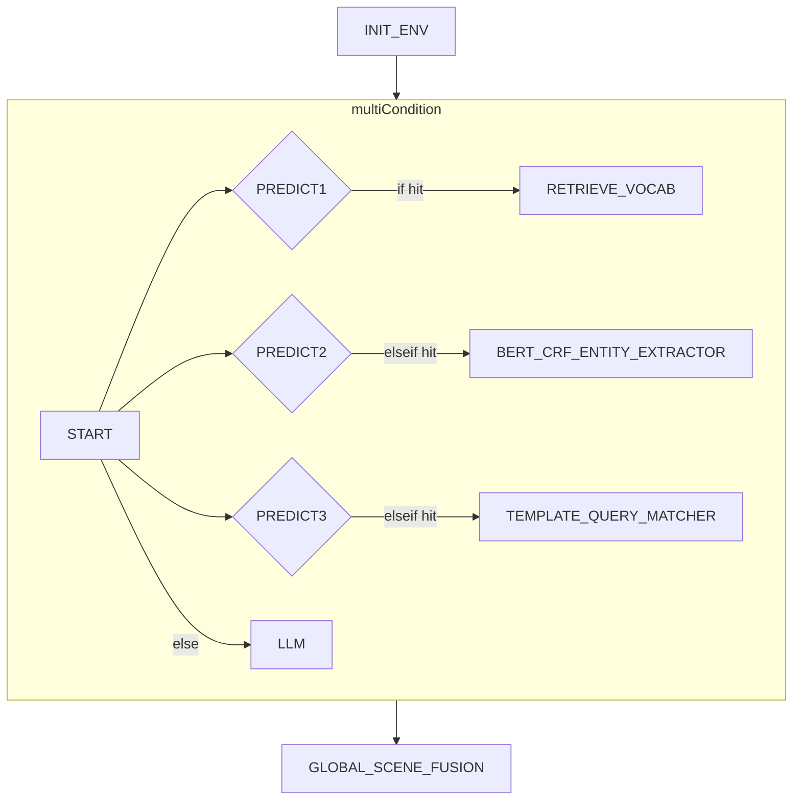
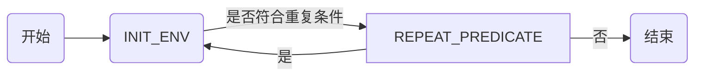
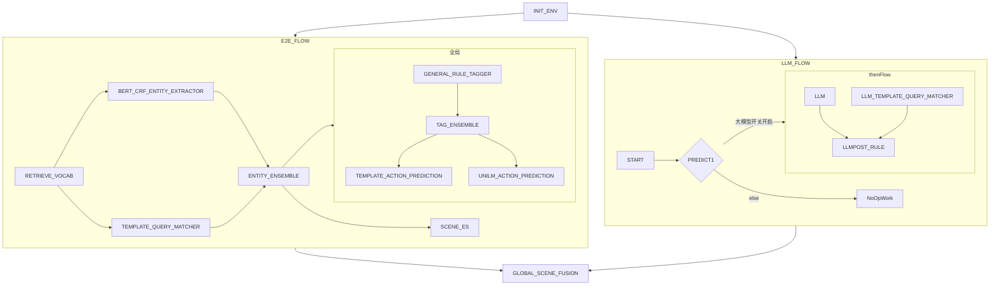

# XPComponentStep 类文档说明

## 概述

`XPComponentStep` 类是 `com.xiaopeng.workflow.components` 包的一部分。它代表工作流中的一个步骤，可以是以下几种类型：单一(
single)、顺序(sequential)、并行(parallel)、条件(conditional)、重复(repeat)。

## 类型解析

### 单一(single)

单一类型的步骤表示在工作流中只执行一个操作。在 `XPComponentStep` 中，如果 `type` 字段为 "single"，则表示此步骤是单一操作。
该类型为工作流中最原子单元，不包含其他操作。



### 顺序(sequential)

顺序类型的步骤表示在工作流中按照一定的顺序执行一系列的操作。在 `XPComponentStep` 中，如果 `type` 字段为 "sequential"
，则 `sequentialSteps` 字段会包含一个 `XPComponentStep` 对象的列表，表示顺序执行的步骤。
以下示例中第一步、第二步、第N步操作都可能为其他类型工作流组合成的业务单元。



### 并行(parallel)

并行类型的步骤表示在工作流中同时执行多个操作。在 `XPComponentStep` 中，如果 `type` 字段为 "parallel"，则 `parallelSteps`
字段会包含一个 `XPComponentStep` 对象的列表，表示并行执行的步骤。



### 条件(conditional)

条件类型的步骤表示在工作流中根据一定的条件选择执行不同的操作。在 `XPComponentStep` 中，如果 `type` 字段为 "conditional"
，则 `conditionSteps` 字段会包含一个 `XPConditionStep` 对象的列表，表示条件执行的步骤。
因原始 `org.jeasy.flows.workflow.ConditionalFlow`
未提供多条件实现，现重新定义多条件条件流，详情请看`com.xiaopeng.workflow.components.base.MulitConditionalFlow`。



### 重复(repeat)

重复类型的步骤表示在工作流中重复执行一个操作。类似 do while形式，该类型，先执行工作单元，再判断是否继续repeat.
在 `XPComponentStep` 中，如果 `type` 字段为 "repeat"，则 `repeatStep`
字段会包含一个 `XPRepeatStep` 对象，表示重复执行的步骤。



# XPWorkFLowBuilder 类文档

## 概述

`XPWorkFLowBuilder` 类是 `com.xiaopeng.workflow.components` 包的一部分。它用于构建工作流，根据 `XPComponentStep`
的类型，选择不同的解析器进行解析。
XPWorkFLowBuilder 类为流程解析的总入口类，它会根据传入的 `XPComponentStep`
对象，选择不同的解析器进行解析。具体解析请看`com.xiaopeng.workflow.components.parser` 包下的相关实现。

# 使用示例

## 1. 顺序流

首先，我们需要创建一个简单的顺序流工作流。在这个例子中，我们将创建一个包含三个步骤的顺序流：初始化操作，获取词汇表，全局场景融合。每个步骤都由一个组件来执行。

以下是JSON字符串表示的工作流：

```json
{
  "name": "顺序流示例",
  "type": "sequential",
  "sequentialSteps": [
    {
      "name": "初始化操作",
      "component": "INIT_ENV"
    },
    {
      "name": "获取词汇表",
      "component": "RETRIEVE_VOCAB"
    },
    {
      "name": "全局场景融合",
      "component": "GLOBAL_SCENE_FUSION"
    }
  ]
}
```

对应流程图如下：



这个流程图表示了工作流的执行顺序：首先执行初始化操作，然后获取词汇表，最后进行全局场景融合。

## UT

```shell
mvn clean test -D test=com.xiaopeng.workflow.HelloEasyFlowBpmnApplicationTests#testSimpleSequential -e

16:59:48.801 [main] INFO   - jsonStr:{"name":"顺序流示例","type":"sequential","sequentialSteps":[{"name":"初始化操作","component":"INIT_ENV"},{"name":"获取词汇表","component":"RETRIEVE_VOCAB"},{"name":"全局场景融合","component":"GLOBAL_SCENE_FUSION"}]}
16:59:48.875 [main] INFO   - ===================> sequential mWDtscNp build start <====================
16:59:48.875 [main] INFO   - build single component:INIT_ENV
16:59:48.875 [main] INFO   - build single component:RETRIEVE_VOCAB
16:59:48.875 [main] INFO   - build single component:GLOBAL_SCENE_FUSION
16:59:48.879 [main] INFO   - ===================> sequential mWDtscNp flow build success, component info  ==> {"name":"顺序流示例","type":"sequential","sequentialSteps":[{"name":"初始化操作","component":"INIT_ENV","type":"single"},{"name":"获取词汇表","component":"RETRIEVE_VOCAB","type":"single"},{"name":"全局场景融合","component":"GLOBAL_SCENE_FUSION","type":"single"}]} <===
16:59:48.884 [main] INFO   - Running workflow ''顺序流示例''
16:59:48.884 [main] INFO   - INIT_ENV execute start
16:59:51.139 [main] INFO   - INIT_ENV execute end ==> cost time:2255ms
16:59:51.140 [main] INFO   - RETRIEVE_VOCAB execute start
16:59:53.013 [main] INFO   - RETRIEVE_VOCAB execute end ==> cost time:1867ms
16:59:53.013 [main] INFO   - globalSceneFusion execute start
16:59:56.008 [main] INFO   - GLOBAL_SCENE_FUSION execute end ==> cost time:2991ms
16:59:56.009 [main] INFO   - report:{"status":"COMPLETED","workContext":{}}
```

## 2. 简单并行流

首先，我们需要创建一个简单的并行流工作流。在这个例子中，我们将创建一个包含三个步骤的并行流：初始化操作，获取词汇表，全局场景融合。每个步骤都由一个组件来执行，但是这些步骤会并行执行。

以下是JSON字符串表示的工作流：

```json
{
  "name": "并行流示例",
  "type": "parallel",
  "parallelSteps": [
    {
      "name": "初始化操作",
      "component": "INIT_ENV"
    },
    {
      "name": "获取词汇表",
      "component": "RETRIEVE_VOCAB"
    },
    {
      "name": "全局场景融合",
      "component": "GLOBAL_SCENE_FUSION"
    }
  ]
}
```

对应流程图如下：



这个流程图表示了工作流的执行顺序：初始化操作，获取词汇表，全局场景融合这三个步骤会并行执行。

## UT

```shell
mvn clean test -D test=com.xiaopeng.workflow.HelloEasyFlowBpmnApplicationTests#testSimpleParallel -e

17:00:29.071 [main] INFO   - jsonStr:{"name":"并行流示例","type":"parallel","parallelSteps":[{"name":"初始化操作","component":"INIT_ENV"},{"name":"获取词汇表","component":"RETRIEVE_VOCAB"},{"name":"全局场景融合","component":"GLOBAL_SCENE_FUSION"}]}
17:00:29.147 [main] INFO   - ===================> parallel v36teDhP build start <====================
17:00:29.147 [main] INFO   - build single component:INIT_ENV
17:00:29.147 [main] INFO   - build single component:RETRIEVE_VOCAB
17:00:29.147 [main] INFO   - build single component:GLOBAL_SCENE_FUSION
17:00:29.152 [main] INFO   - ===================> parallel v36teDhP flow build success, component info  ==> {"name":"并行流示例","type":"parallel","parallelSteps":[{"name":"初始化操作","component":"INIT_ENV","type":"single"},{"name":"获取词汇表","component":"RETRIEVE_VOCAB","type":"single"},{"name":"全局场景融合","component":"GLOBAL_SCENE_FUSION","type":"single"}]} <===
17:00:29.156 [main] INFO   - Running workflow ''并行流示例''
17:00:29.157 [pool-2-thread-1] INFO   - INIT_ENV execute start
17:00:29.157 [pool-2-thread-2] INFO   - RETRIEVE_VOCAB execute start
17:00:29.157 [pool-2-thread-3] INFO   - globalSceneFusion execute start
17:00:32.962 [pool-2-thread-3] INFO   - GLOBAL_SCENE_FUSION execute end ==> cost time:3802ms
17:00:33.557 [pool-2-thread-2] INFO   - RETRIEVE_VOCAB execute end ==> cost time:4395ms
17:00:33.926 [pool-2-thread-1] INFO   - INIT_ENV execute end ==> cost time:4767ms
17:00:33.928 [main] INFO   - report:{"reports":[{"status":"COMPLETED","workContext":{}},{"status":"COMPLETED","workContext":{}},{"status":"COMPLETED","workContext":{}}]}

```

## 3.多条件流

首先，我们需要创建一个多条件流工作流。在这个例子中，我们将创建一个包含三个个条件的多条件流：条件1和条件2
以下为JSON字符串表示的工作流：

```json
{
  "name": "条件判断工作流示例",
  "type": "sequential",
  "sequentialSteps": [
    {
      "name": "初始化操作",
      "component": "INIT_ENV"
    },
    {
      "name": "多条件流",
      "type": "conditional",
      "conditionSteps": [
        {
          "predicateClassName": "com.xiaopeng.workflow.components.predict.MulitPredicate.IF_RETRIEVE_VOCAB_CASE",
          "componentStep": {
            "name": "获取词汇表",
            "component": "RETRIEVE_VOCAB"
          }
        },
        {
          "predicateClassName": "com.xiaopeng.workflow.components.predict.MulitPredicate.IF_BERT_CRF_ENTITY_EXTRACTOR_CASE",
          "componentStep": {
            "name": "BERT_CRF_ENTITY_EXTRACTOR",
            "component": "BERT_CRF_ENTITY_EXTRACTOR"
          }
        },
        {
          "predicateClassName": "com.xiaopeng.workflow.components.predict.MulitPredicate.IF_TEMPLATE_QUERY_MATCHER_CASE",
          "componentStep": {
            "name": "TEMPLATE_QUERY_MATCHER",
            "component": "TEMPLATE_QUERY_MATCHER"
          }
        },
        {
          "conditionStep": 2,
          "componentStep": {
            "name": "LLM",
            "component": "LLM"
          }
        }
      ]
    },
    {
      "name": "全局场景融合",
      "component": "GLOBAL_SCENE_FUSION"
    }
  ]
}
```   

对应流程图如下：



UT

```shell
mvn clean test -D test=com.xiaopeng.workflow.HelloEasyFlowBpmnApplicationTests#testSimpleMulitCondition -e

17:01:57.000 [main] INFO   - jsonStr:{"name":"条件判断工作流示例","type":"sequential","sequentialSteps":[{"name":"初始化操作","component":"INIT_ENV"},{"name":"多条件流","type":"conditional","conditionSteps":[{"predicateClassName":"com.xiaopeng.workflow.components.predict.MulitPredicate.IF_RETRIEVE_VOCAB_CASE","componentStep":{"name":"获取词汇表","component":"RETRIEVE_VOCAB"}},{"predicateClassName":"com.xiaopeng.workflow.components.predict.MulitPredicate.IF_BERT_CRF_ENTITY_EXTRACTOR_CASE","componentStep":{"name":"BERT_CRF_ENTITY_EXTRACTOR","component":"BERT_CRF_ENTITY_EXTRACTOR"}},{"predicateClassName":"com.xiaopeng.workflow.components.predict.MulitPredicate.IF_TEMPLATE_QUERY_MATCHER_CASE","componentStep":{"name":"TEMPLATE_QUERY_MATCHER","component":"TEMPLATE_QUERY_MATCHER"}},{"conditionStep":2,"componentStep":{"name":"LLM","component":"LLM"}}]},{"name":"全局场景融合","component":"GLOBAL_SCENE_FUSION"}]}
17:01:57.096 [main] INFO   - ===================> sequential b9slw02I build start <====================
17:01:57.096 [main] INFO   - build single component:INIT_ENV
17:01:57.097 [main] INFO   - ===================> conditional Q3tOsKbK build start <====================
17:01:57.098 [main] INFO   - build single component:RETRIEVE_VOCAB
17:01:57.102 [main] INFO   - build single component:BERT_CRF_ENTITY_EXTRACTOR
17:01:57.103 [main] INFO   - build single component:TEMPLATE_QUERY_MATCHER
17:01:57.104 [main] INFO   - build single component:LLM
17:01:57.110 [main] INFO   - ===================> conditional Q3tOsKbK flow build success, component info  ==> {"name":"多条件流","type":"conditional","conditionSteps":[{"conditionStep":1,"predicateClassName":"com.xiaopeng.workflow.components.predict.MulitPredicate.IF_RETRIEVE_VOCAB_CASE","componentStep":{"name":"获取词汇表","component":"RETRIEVE_VOCAB","type":"single"}},{"conditionStep":1,"predicateClassName":"com.xiaopeng.workflow.components.predict.MulitPredicate.IF_BERT_CRF_ENTITY_EXTRACTOR_CASE","componentStep":{"name":"BERT_CRF_ENTITY_EXTRACTOR","component":"BERT_CRF_ENTITY_EXTRACTOR","type":"single"}},{"conditionStep":1,"predicateClassName":"com.xiaopeng.workflow.components.predict.MulitPredicate.IF_TEMPLATE_QUERY_MATCHER_CASE","componentStep":{"name":"TEMPLATE_QUERY_MATCHER","component":"TEMPLATE_QUERY_MATCHER","type":"single"}},{"conditionStep":2,"componentStep":{"name":"LLM","component":"LLM","type":"single"}}]} <===
17:01:57.110 [main] INFO   - build single component:GLOBAL_SCENE_FUSION
17:01:57.112 [main] INFO   - ===================> sequential b9slw02I flow build success, component info  ==> {"name":"条件判断工作流示例","type":"sequential","sequentialSteps":[{"name":"初始化操作","component":"INIT_ENV","type":"single"},{"name":"多条件流","type":"conditional","conditionSteps":[{"conditionStep":1,"predicateClassName":"com.xiaopeng.workflow.components.predict.MulitPredicate.IF_RETRIEVE_VOCAB_CASE","componentStep":{"name":"获取词汇表","component":"RETRIEVE_VOCAB","type":"single"}},{"conditionStep":1,"predicateClassName":"com.xiaopeng.workflow.components.predict.MulitPredicate.IF_BERT_CRF_ENTITY_EXTRACTOR_CASE","componentStep":{"name":"BERT_CRF_ENTITY_EXTRACTOR","component":"BERT_CRF_ENTITY_EXTRACTOR","type":"single"}},{"conditionStep":1,"predicateClassName":"com.xiaopeng.workflow.components.predict.MulitPredicate.IF_TEMPLATE_QUERY_MATCHER_CASE","componentStep":{"name":"TEMPLATE_QUERY_MATCHER","component":"TEMPLATE_QUERY_MATCHER","type":"single"}},{"conditionStep":2,"componentStep":{"name":"LLM","component":"LLM","type":"single"}}]},{"name":"全局场景融合","component":"GLOBAL_SCENE_FUSION","type":"single"}]} <===
17:01:57.115 [main] INFO   - Running workflow ''条件判断工作流示例''
17:01:57.115 [main] INFO   - INIT_ENV execute start
17:02:01.950 [main] INFO   - INIT_ENV execute end ==> cost time:4831ms
17:02:01.951 [main] INFO   - IF_RETRIEVE_VOCAB_CASE judge 是否命中分支条件 ==> false
17:02:01.951 [main] INFO   - IF_BERT_CRF_ENTITY_EXTRACTOR_CASE judge 是否命中分支条件 ==> false
17:02:01.951 [main] INFO   - IF_TEMPLATE_QUERY_MATCHER_CASE judge 是否命中分支条件 ==> false
17:02:01.951 [main] INFO   - LLM execute start
17:02:02.093 [main] INFO   - LLM execute end ==> cost time:138ms
17:02:02.093 [main] INFO   - globalSceneFusion execute start
17:02:02.170 [main] INFO   - GLOBAL_SCENE_FUSION execute end ==> cost time:72ms
17:02:02.171 [main] INFO   - report:{"status":"COMPLETED","workContext":{}}
```

## 4.重复流

首先，我们需要创建一个重复流工作流。在这个例子中，我们将创建一个包含一个重复流的工作流：重复单元为初始化操作单元。这个步骤步骤会重复执行3次。

以下是JSON字符串表示的工作流：

```json
{
  "name": "repeat工作流示例",
  "type": "sequential",
  "sequentialSteps": [
    {
      "name": "重复3次",
      "type": "repeat",
      "repeatStep": {
        "predicateClassName": "com.xiaopeng.workflow.components.predict.MulitPredicate.REPEAT_PREDICATE",
        "componentStep": {
          "name": "INIT_ENV",
          "component": "INIT_ENV"
        }
      }
    }
  ]
}
```

对应流程图如下：



```shell
mvn clean test -D test=com.xiaopeng.workflow.HelloEasyFlowBpmnApplicationTests#testSimpleRepeatCase -e

17:02:51.437 [main] INFO   - jsonStr:{"name":"repeat工作流示例","type":"sequential","sequentialSteps":[{"name":"重复3次","type":"repeat","repeatStep":{"predicateClassName":"com.xiaopeng.workflow.components.predict.MulitPredicate.REPEAT_PREDICATE","componentStep":{"name":"INIT_ENV","component":"INIT_ENV"}}}]}
17:02:51.526 [main] INFO   - ===================> sequential t2utCyUC build start <====================
17:02:51.526 [main] INFO   - ===================> repeat KWvF6Z2J build start <====================
17:02:51.530 [main] INFO   - build single component:INIT_ENV
17:02:51.534 [main] INFO   - ===================> repeat KWvF6Z2J flow build success, component info  ==> {"name":"重复3次","type":"repeat","repeatStep":{"predicateClassName":"com.xiaopeng.workflow.components.predict.MulitPredicate.REPEAT_PREDICATE","componentStep":{"name":"INIT_ENV","component":"INIT_ENV","type":"single"}}} <===
17:02:51.538 [main] INFO   - ===================> sequential t2utCyUC flow build success, component info  ==> {"name":"repeat工作流示例","type":"sequential","sequentialSteps":[{"name":"重复3次","type":"repeat","repeatStep":{"predicateClassName":"com.xiaopeng.workflow.components.predict.MulitPredicate.REPEAT_PREDICATE","componentStep":{"name":"INIT_ENV","component":"INIT_ENV","type":"single"}}}]} <===
17:02:51.541 [main] INFO   - Running workflow ''repeat工作流示例''
17:02:51.541 [main] INFO   - INIT_ENV execute start
17:02:53.669 [main] INFO   - INIT_ENV execute end ==> cost time:2123ms
17:02:53.669 [main] INFO   - repeat 次数 1
17:02:53.670 [main] INFO   - INIT_ENV execute start
17:02:57.686 [main] INFO   - INIT_ENV execute end ==> cost time:4012ms
17:02:57.686 [main] INFO   - repeat 次数 2
17:02:57.687 [main] INFO   - INIT_ENV execute start
17:03:02.392 [main] INFO   - INIT_ENV execute end ==> cost time:4703ms
17:03:02.392 [main] INFO   - repeat 次数 3
17:03:02.393 [main] INFO   - report:{"status":"COMPLETED","workContext":{}}
```


## 复杂流程示例

### json 结构示例
```json
{
  "name": "复杂工作流示例",
  "type": "sequential",
  "sequentialSteps": [
    {
      "name": "初始化操作",
      "component": "INIT_ENV"
    },
    {
      "name": "e2e and llm flow",
      "type": "parallel",
      "parallelSteps": [
        {
          "name": "e2e-flow",
          "type": "sequential",
          "sequentialSteps": [
            {
              "name": "获取词汇表",
              "component": "RETRIEVE_VOCAB"
            },
            {
              "name": "并行执行",
              "type": "parallel",
              "parallelSteps": [
                {
                  "component": "BERT_CRF_ENTITY_EXTRACTOR"
                },
                {
                  "component": "TEMPLATE_QUERY_MATCHER"
                }
              ]
            },
            {
              "name": "实体集成",
              "component": "ENTITY_ENSEMBLE"
            },
            {
              "name": "并行执行全局节点和可见及可说节点",
              "type": "parallel",
              "parallelSteps": [
                {
                  "name": "全局节点",
                  "type": "sequential",
                  "sequentialSteps": [
                    {
                      "name": "初始化操作",
                      "component": "GENERAL_RULE_TAGGER"
                    },
                    {
                      "name": "标签集成",
                      "component": "TAG_ENSEMBLE"
                    },
                    {
                      "name": "并行执行预测",
                      "type": "parallel",
                      "parallelSteps": [
                        {
                          "component": "TEMPLATE_ACTION_PREDICTION"
                        },
                        {
                          "component": "UNILM_ACTION_PREDICTION"
                        }
                      ]
                    }
                  ]
                },
                {
                  "name": "场景ES",
                  "component": "SCENE_ES"
                }
              ]
            }
          ]
        },
        {
          "name": "llm 链路",
          "type": "conditional",
          "conditionSteps": [
            {
              "predicateClassName": "com.xiaopeng.workflow.components.predict.XGPTSwitchPredicate",
              "componentStep": {
                "type": "sequential",
                "name": "thenWorkFlow",
                "sequentialSteps": [
                  {
                    "name": "thenWorkFlow",
                    "type": "sequential",
                    "conditionStep": 1,
                    "sequentialSteps": [
                      {
                        "name": "llmParael",
                        "type": "parallel",
                        "parallelSteps": [
                          {
                            "name": "LLM",
                            "component": "LLM"
                          },
                          {
                            "name": "LLM_TEMPLATE_QUERY_MATCHER",
                            "component": "LLM_TEMPLATE_QUERY_MATCHER"
                          }
                        ]
                      },
                      {
                        "name": "LLMPOST_RULE",
                        "component": "LLMPOST_RULE"
                      }
                    ]
                  }
                ]
              }
            }
          ]
        }
      ]
    },
    {
      "name": "全局场景融合",
      "component": "GLOBAL_SCENE_FUSION"
    }
  ]
}
```

### yml 结构示例
```yaml
name: 复杂工作流示例
type: sequential
sequentialSteps:
  - name: 初始化操作
    component: INIT_ENV
  - name: e2e and llm flow
    type: parallel
    parallelSteps:
      - name: e2e-flow
        type: sequential
        sequentialSteps:
          - name: 获取词汇表
            component: RETRIEVE_VOCAB
          - name: 并行执行
            type: parallel
            parallelSteps:
              - component: BERT_CRF_ENTITY_EXTRACTOR
              - component: TEMPLATE_QUERY_MATCHER
          - name: 实体集成
            component: ENTITY_ENSEMBLE
          - name: 并行执行全局节点和可见及可说节点
            type: parallel
            parallelSteps:
              - name: 全局节点
                type: sequential
                sequentialSteps:
                  - name: 初始化操作
                    component: GENERAL_RULE_TAGGER
                  - name: 标签集成
                    component: TAG_ENSEMBLE
                  - name: 并行执行预测
                    type: parallel
                    parallelSteps:
                      - component: TEMPLATE_ACTION_PREDICTION
                      - component: UNILM_ACTION_PREDICTION
              - name: 场景ES
                component: SCENE_ES
      - name: llm 链路
        type: conditional
        conditionSteps:
          - predicateClassName: com.xiaopeng.workflow.components.predict.XGPTSwitchPredicate
            componentStep:
              type: sequential
              name: thenWorkFlow
              sequentialSteps:
                - name: thenWorkFlow
                  type: sequential
                  conditionStep: 1
                  sequentialSteps:
                    - name: llmParael
                      type: parallel
                      parallelSteps:
                        - name: LLM
                          component: LLM
                        - name: LLM_TEMPLATE_QUERY_MATCHER
                          component: LLM_TEMPLATE_QUERY_MATCHER
                    - name: LLMPOST_RULE
                      component: LLMPOST_RULE
  - name: 全局场景融合
    component: GLOBAL_SCENE_FUSION

```


## 流程图


## UT

```shell
mvn clean test -D test=com.xiaopeng.workflow.HelloEasyFlowBpmnApplicationTests#testComplexFlow -e

17:03:53.665 [main] INFO   - jsonStr:{"name":"复杂工作流示例","type":"sequential","sequentialSteps":[{"name":"初始化操作","component":"INIT_ENV"},{"name":"e2e and llm flow","type":"parallel","parallelSteps":[{"name":"e2e-flow","type":"sequential","sequentialSteps":[{"name":"获取词汇表","component":"RETRIEVE_VOCAB"},{"name":"并行执行","type":"parallel","parallelSteps":[{"component":"BERT_CRF_ENTITY_EXTRACTOR"},{"component":"TEMPLATE_QUERY_MATCHER"}]},{"name":"实体集成","component":"ENTITY_ENSEMBLE"},{"name":"并行执行全局节点和可见及可说节点","type":"parallel","parallelSteps":[{"name":"全局节点","type":"sequential","sequentialSteps":[{"name":"初始化操作","component":"GENERAL_RULE_TAGGER"},{"name":"标签集成","component":"TAG_ENSEMBLE"},{"name":"并行执行预测","type":"parallel","parallelSteps":[{"component":"TEMPLATE_ACTION_PREDICTION"},{"component":"UNILM_ACTION_PREDICTION"}]}]},{"name":"场景ES","component":"SCENE_ES"}]}]},{"name":"llm 链路","type":"conditional","conditionSteps":[{"predicateClassName":"com.xiaopeng.workflow.components.predict.XGPTSwitchPredicate","componentStep":{"type":"sequential","name":"thenWorkFlow","sequentialSteps":[{"name":"thenWorkFlow","type":"sequential","conditionStep":1,"sequentialSteps":[{"name":"llmParael","type":"parallel","parallelSteps":[{"name":"LLM","component":"LLM"},{"name":"LLM_TEMPLATE_QUERY_MATCHER","component":"LLM_TEMPLATE_QUERY_MATCHER"}]},{"name":"LLMPOST_RULE","component":"LLMPOST_RULE"}]}]}}]}]},{"name":"全局场景融合","component":"GLOBAL_SCENE_FUSION"}]}
17:03:53.759 [main] INFO   - ===================> sequential fV1vtF0l build start <====================
17:03:53.760 [main] INFO   - build single component:INIT_ENV
17:03:53.760 [main] INFO   - ===================> parallel AFwTblRW build start <====================
17:03:53.760 [main] INFO   - ===================> sequential KqVNtx3Z build start <====================
17:03:53.760 [main] INFO   - build single component:RETRIEVE_VOCAB
17:03:53.760 [main] INFO   - ===================> parallel MRVaL6Dw build start <====================
17:03:53.760 [main] INFO   - build single component:BERT_CRF_ENTITY_EXTRACTOR
17:03:53.760 [main] INFO   - build single component:TEMPLATE_QUERY_MATCHER
17:03:53.765 [main] INFO   - ===================> parallel MRVaL6Dw flow build success, component info  ==> {"name":"并行执行","type":"parallel","parallelSteps":[{"component":"BERT_CRF_ENTITY_EXTRACTOR","type":"single"},{"component":"TEMPLATE_QUERY_MATCHER","type":"single"}]} <===
17:03:53.771 [main] INFO   - build single component:ENTITY_ENSEMBLE
17:03:53.771 [main] INFO   - ===================> parallel 0AVqwXO4 build start <====================
17:03:53.771 [main] INFO   - ===================> sequential 7W3jkBzD build start <====================
17:03:53.771 [main] INFO   - build single component:GENERAL_RULE_TAGGER
17:03:53.771 [main] INFO   - build single component:TAG_ENSEMBLE
17:03:53.771 [main] INFO   - ===================> parallel 6Co6BAWJ build start <====================
17:03:53.771 [main] INFO   - build single component:TEMPLATE_ACTION_PREDICTION
17:03:53.771 [main] INFO   - build single component:UNILM_ACTION_PREDICTION
17:03:53.772 [main] INFO   - ===================> parallel 6Co6BAWJ flow build success, component info  ==> {"name":"并行执行预测","type":"parallel","parallelSteps":[{"component":"TEMPLATE_ACTION_PREDICTION","type":"single"},{"component":"UNILM_ACTION_PREDICTION","type":"single"}]} <===
17:03:53.773 [main] INFO   - ===================> sequential 7W3jkBzD flow build success, component info  ==> {"name":"全局节点","type":"sequential","sequentialSteps":[{"name":"初始化操作","component":"GENERAL_RULE_TAGGER","type":"single"},{"name":"标签集成","component":"TAG_ENSEMBLE","type":"single"},{"name":"并行执行预测","type":"parallel","parallelSteps":[{"component":"TEMPLATE_ACTION_PREDICTION","type":"single"},{"component":"UNILM_ACTION_PREDICTION","type":"single"}]}]} <===
17:03:53.775 [main] INFO   - build single component:SCENE_ES
17:03:53.777 [main] INFO   - ===================> parallel 0AVqwXO4 flow build success, component info  ==> {"name":"并行执行全局节点和可见及可说节点","type":"parallel","parallelSteps":[{"name":"全局节点","type":"sequential","sequentialSteps":[{"name":"初始化操作","component":"GENERAL_RULE_TAGGER","type":"single"},{"name":"标签集成","component":"TAG_ENSEMBLE","type":"single"},{"name":"并行执行预测","type":"parallel","parallelSteps":[{"component":"TEMPLATE_ACTION_PREDICTION","type":"single"},{"component":"UNILM_ACTION_PREDICTION","type":"single"}]}]},{"name":"场景ES","component":"SCENE_ES","type":"single"}]} <===
17:03:53.779 [main] INFO   - ===================> sequential KqVNtx3Z flow build success, component info  ==> {"name":"e2e-flow","type":"sequential","sequentialSteps":[{"name":"获取词汇表","component":"RETRIEVE_VOCAB","type":"single"},{"name":"并行执行","type":"parallel","parallelSteps":[{"component":"BERT_CRF_ENTITY_EXTRACTOR","type":"single"},{"component":"TEMPLATE_QUERY_MATCHER","type":"single"}]},{"name":"实体集成","component":"ENTITY_ENSEMBLE","type":"single"},{"name":"并行执行全局节点和可见及可说节点","type":"parallel","parallelSteps":[{"name":"全局节点","type":"sequential","sequentialSteps":[{"name":"初始化操作","component":"GENERAL_RULE_TAGGER","type":"single"},{"name":"标签集成","component":"TAG_ENSEMBLE","type":"single"},{"name":"并行执行预测","type":"parallel","parallelSteps":[{"component":"TEMPLATE_ACTION_PREDICTION","type":"single"},{"component":"UNILM_ACTION_PREDICTION","type":"single"}]}]},{"name":"场景ES","component":"SCENE_ES","type":"single"}]}]} <===
17:03:53.780 [main] INFO   - ===================> conditional JzwMR2u6 build start <====================
17:03:53.781 [main] INFO   - ===================> sequential SxDRO7yz build start <====================
17:03:53.781 [main] INFO   - ===================> sequential jPiZxeuo build start <====================
17:03:53.781 [main] INFO   - ===================> parallel oAJdjghr build start <====================
17:03:53.781 [main] INFO   - build single component:LLM
17:03:53.781 [main] INFO   - build single component:LLM_TEMPLATE_QUERY_MATCHER
17:03:53.782 [main] INFO   - ===================> parallel oAJdjghr flow build success, component info  ==> {"name":"llmParael","type":"parallel","parallelSteps":[{"name":"LLM","component":"LLM","type":"single"},{"name":"LLM_TEMPLATE_QUERY_MATCHER","component":"LLM_TEMPLATE_QUERY_MATCHER","type":"single"}]} <===
17:03:53.782 [main] INFO   - build single component:LLMPOST_RULE
17:03:53.783 [main] INFO   - ===================> sequential jPiZxeuo flow build success, component info  ==> {"name":"thenWorkFlow","type":"sequential","sequentialSteps":[{"name":"llmParael","type":"parallel","parallelSteps":[{"name":"LLM","component":"LLM","type":"single"},{"name":"LLM_TEMPLATE_QUERY_MATCHER","component":"LLM_TEMPLATE_QUERY_MATCHER","type":"single"}]},{"name":"LLMPOST_RULE","component":"LLMPOST_RULE","type":"single"}]} <===
17:03:53.785 [main] INFO   - ===================> sequential SxDRO7yz flow build success, component info  ==> {"name":"thenWorkFlow","type":"sequential","sequentialSteps":[{"name":"thenWorkFlow","type":"sequential","sequentialSteps":[{"name":"llmParael","type":"parallel","parallelSteps":[{"name":"LLM","component":"LLM","type":"single"},{"name":"LLM_TEMPLATE_QUERY_MATCHER","component":"LLM_TEMPLATE_QUERY_MATCHER","type":"single"}]},{"name":"LLMPOST_RULE","component":"LLMPOST_RULE","type":"single"}]}]} <===
17:03:53.791 [main] INFO   - ===================> conditional JzwMR2u6 flow build success, component info  ==> {"name":"llm 链路","type":"conditional","conditionSteps":[{"conditionStep":1,"predicateClassName":"com.xiaopeng.workflow.components.predict.XGPTSwitchPredicate","componentStep":{"name":"thenWorkFlow","type":"sequential","sequentialSteps":[{"name":"thenWorkFlow","type":"sequential","sequentialSteps":[{"name":"llmParael","type":"parallel","parallelSteps":[{"name":"LLM","component":"LLM","type":"single"},{"name":"LLM_TEMPLATE_QUERY_MATCHER","component":"LLM_TEMPLATE_QUERY_MATCHER","type":"single"}]},{"name":"LLMPOST_RULE","component":"LLMPOST_RULE","type":"single"}]}]}}]} <===
17:03:53.793 [main] INFO   - ===================> parallel AFwTblRW flow build success, component info  ==> {"name":"e2e and llm flow","type":"parallel","parallelSteps":[{"name":"e2e-flow","type":"sequential","sequentialSteps":[{"name":"获取词汇表","component":"RETRIEVE_VOCAB","type":"single"},{"name":"并行执行","type":"parallel","parallelSteps":[{"component":"BERT_CRF_ENTITY_EXTRACTOR","type":"single"},{"component":"TEMPLATE_QUERY_MATCHER","type":"single"}]},{"name":"实体集成","component":"ENTITY_ENSEMBLE","type":"single"},{"name":"并行执行全局节点和可见及可说节点","type":"parallel","parallelSteps":[{"name":"全局节点","type":"sequential","sequentialSteps":[{"name":"初始化操作","component":"GENERAL_RULE_TAGGER","type":"single"},{"name":"标签集成","component":"TAG_ENSEMBLE","type":"single"},{"name":"并行执行预测","type":"parallel","parallelSteps":[{"component":"TEMPLATE_ACTION_PREDICTION","type":"single"},{"component":"UNILM_ACTION_PREDICTION","type":"single"}]}]},{"name":"场景ES","component":"SCENE_ES","type":"single"}]}]},{"name":"llm 链路","type":"conditional","conditionSteps":[{"conditionStep":1,"predicateClassName":"com.xiaopeng.workflow.components.predict.XGPTSwitchPredicate","componentStep":{"name":"thenWorkFlow","type":"sequential","sequentialSteps":[{"name":"thenWorkFlow","type":"sequential","sequentialSteps":[{"name":"llmParael","type":"parallel","parallelSteps":[{"name":"LLM","component":"LLM","type":"single"},{"name":"LLM_TEMPLATE_QUERY_MATCHER","component":"LLM_TEMPLATE_QUERY_MATCHER","type":"single"}]},{"name":"LLMPOST_RULE","component":"LLMPOST_RULE","type":"single"}]}]}}]}]} <===
17:03:53.793 [main] INFO   - build single component:GLOBAL_SCENE_FUSION
17:03:53.795 [main] INFO   - ===================> sequential fV1vtF0l flow build success, component info  ==> {"name":"复杂工作流示例","type":"sequential","sequentialSteps":[{"name":"初始化操作","component":"INIT_ENV","type":"single"},{"name":"e2e and llm flow","type":"parallel","parallelSteps":[{"name":"e2e-flow","type":"sequential","sequentialSteps":[{"name":"获取词汇表","component":"RETRIEVE_VOCAB","type":"single"},{"name":"并行执行","type":"parallel","parallelSteps":[{"component":"BERT_CRF_ENTITY_EXTRACTOR","type":"single"},{"component":"TEMPLATE_QUERY_MATCHER","type":"single"}]},{"name":"实体集成","component":"ENTITY_ENSEMBLE","type":"single"},{"name":"并行执行全局节点和可见及可说节点","type":"parallel","parallelSteps":[{"name":"全局节点","type":"sequential","sequentialSteps":[{"name":"初始化操作","component":"GENERAL_RULE_TAGGER","type":"single"},{"name":"标签集成","component":"TAG_ENSEMBLE","type":"single"},{"name":"并行执行预测","type":"parallel","parallelSteps":[{"component":"TEMPLATE_ACTION_PREDICTION","type":"single"},{"component":"UNILM_ACTION_PREDICTION","type":"single"}]}]},{"name":"场景ES","component":"SCENE_ES","type":"single"}]}]},{"name":"llm 链路","type":"conditional","conditionSteps":[{"conditionStep":1,"predicateClassName":"com.xiaopeng.workflow.components.predict.XGPTSwitchPredicate","componentStep":{"name":"thenWorkFlow","type":"sequential","sequentialSteps":[{"name":"thenWorkFlow","type":"sequential","sequentialSteps":[{"name":"llmParael","type":"parallel","parallelSteps":[{"name":"LLM","component":"LLM","type":"single"},{"name":"LLM_TEMPLATE_QUERY_MATCHER","component":"LLM_TEMPLATE_QUERY_MATCHER","type":"single"}]},{"name":"LLMPOST_RULE","component":"LLMPOST_RULE","type":"single"}]}]}}]}]},{"name":"全局场景融合","component":"GLOBAL_SCENE_FUSION","type":"single"}]} <===
17:03:53.797 [main] INFO   - Running workflow ''复杂工作流示例''
17:03:53.797 [main] INFO   - INIT_ENV execute start
17:03:58.655 [main] INFO   - INIT_ENV execute end ==> cost time:4854ms
17:03:58.658 [pool-2-thread-1] INFO   - RETRIEVE_VOCAB execute start
17:03:58.658 [pool-2-thread-2] INFO   - XGPTSwitchPredicate 大模型开关开启状态 ==> true
17:03:58.658 [pool-2-thread-3] INFO   - LLM execute start
17:03:58.658 [pool-2-thread-4] INFO   - LLM_TEMPLATE_QUERY_MATCHER execute start
17:03:58.662 [pool-2-thread-3] INFO   - LLM execute end ==> cost time:3ms
17:03:59.990 [pool-2-thread-4] INFO   - LLM_TEMPLATE_QUERY_MATCHER execute end ==> cost time:1328ms
17:03:59.991 [pool-2-thread-2] INFO   - LLMPOST_RULE execute start
17:04:00.674 [pool-2-thread-2] INFO   - LLMPOST_RULE execute end ==> cost time:679ms
17:04:03.109 [pool-2-thread-1] INFO   - RETRIEVE_VOCAB execute end ==> cost time:4447ms
17:04:03.110 [pool-2-thread-5] INFO   - BERT_CRF_ENTITY_EXTRACTOR execute start
17:04:03.111 [pool-2-thread-6] INFO   - TEMPLATE_QUERY_MATCHER execute start
17:04:03.717 [pool-2-thread-6] INFO   - TEMPLATE_QUERY_MATCHER execute end ==> cost time:602ms
17:04:04.102 [pool-2-thread-5] INFO   - BERT_CRF_ENTITY_EXTRACTOR execute end ==> cost time:989ms
17:04:04.103 [pool-2-thread-1] INFO   - ENTITY_ENSEMBLE execute start
17:04:06.877 [pool-2-thread-1] INFO   - ENTITY_ENSEMBLE execute end ==> cost time:2771ms
17:04:06.877 [pool-2-thread-7] INFO   - GENERAL_RULE_TAGGER execute start
17:04:06.877 [pool-2-thread-8] INFO   - SCENE_ES execute start
17:04:07.692 [pool-2-thread-7] INFO   - GENERAL_RULE_TAGGER execute end ==> cost time:813ms
17:04:07.692 [pool-2-thread-7] INFO   - TAG_ENSEMBLE execute start
17:04:10.517 [pool-2-thread-8] INFO   - SCENE_ES execute end ==> cost time:3635ms
17:04:10.541 [pool-2-thread-7] INFO   - TAG_ENSEMBLE execute end ==> cost time:2846ms
17:04:10.542 [pool-2-thread-10] INFO   - UNILM_ACTION_PREDICTION execute start
17:04:10.542 [pool-2-thread-9] INFO   - TEMPLATE_ACTION_PREDICTION execute start
17:04:13.428 [pool-2-thread-9] INFO   - TEMPLATE_ACTION_PREDICTION execute end ==> cost time:2880ms
17:04:15.498 [pool-2-thread-10] INFO   - UNILM_ACTION_PREDICTION execute end ==> cost time:4952ms
17:04:15.499 [main] INFO   - globalSceneFusion execute start
17:04:19.166 [main] INFO   - GLOBAL_SCENE_FUSION execute end ==> cost time:3661ms
17:04:19.167 [main] INFO   - report:{"status":"COMPLETED","workContext":{}}
```