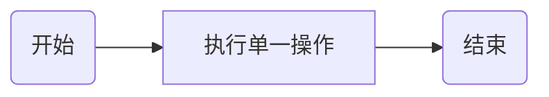
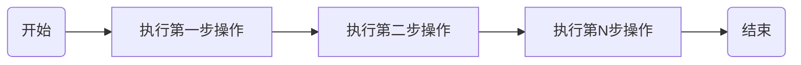
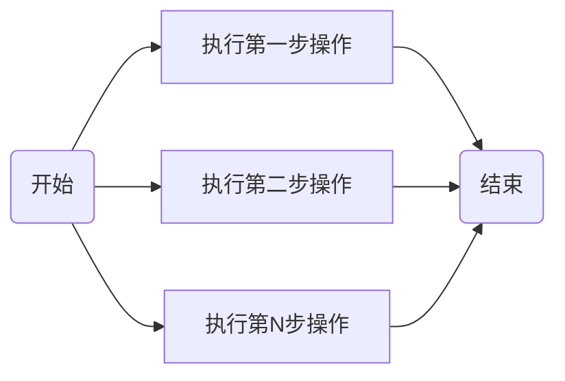
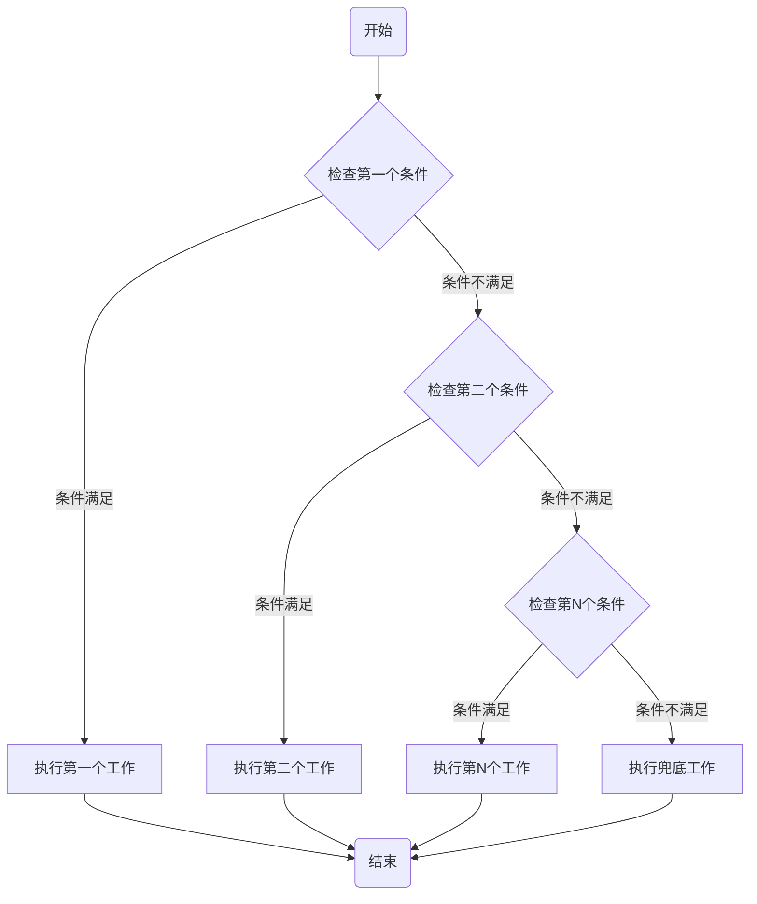
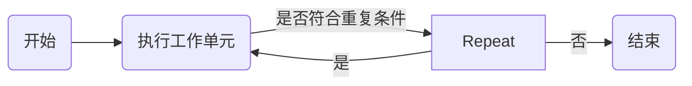
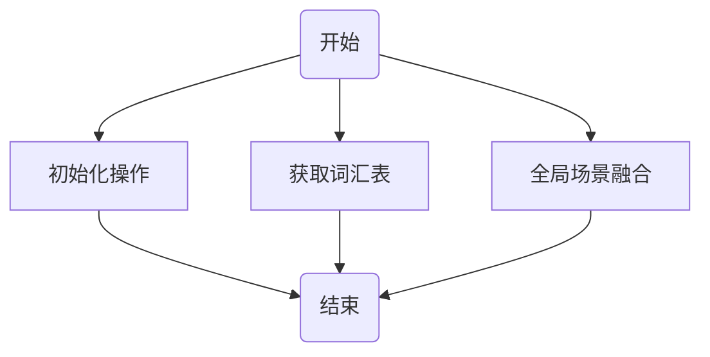
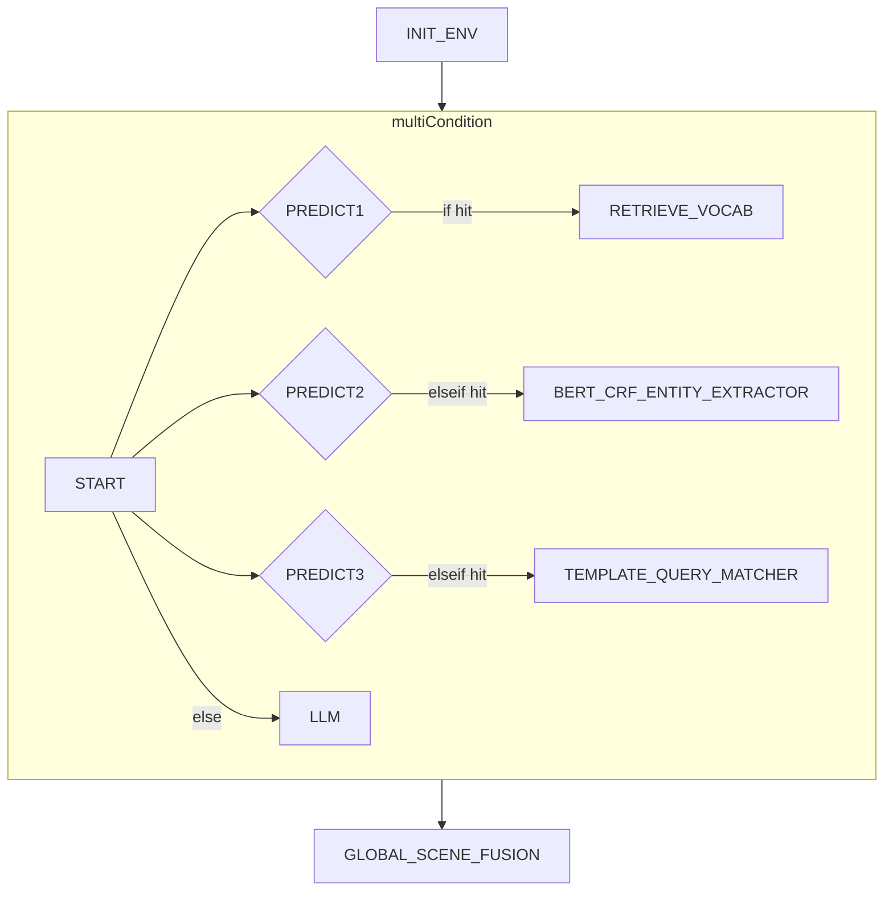
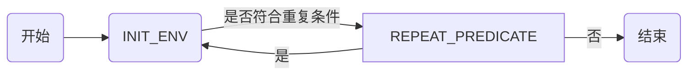

# XPComponentStep 类文档说明

## 概述

`XPComponentStep` 类是 `com.xiaopeng.workflow.components` 包的一部分。它代表工作流中的一个步骤，可以是以下几种类型：单一(
single)、顺序(sequential)、并行(parallel)、条件(conditional)、重复(repeat)。

## 类型解析

### 单一(single)

单一类型的步骤表示在工作流中只执行一个操作。在 `XPComponentStep` 中，如果 `type` 字段为 "single"，则表示此步骤是单一操作。
该类型为工作流中最原子操作，不包含其他操作。



### 顺序(sequential)

顺序类型的步骤表示在工作流中按照一定的顺序执行一系列的操作。在 `XPComponentStep` 中，如果 `type` 字段为 "sequential"
，则 `sequentialSteps` 字段会包含一个 `XPComponentStep` 对象的列表，表示顺序执行的步骤。
以下示例中第一步、第二步、第N步操作都可能为其他类型的步骤。



### 并行(parallel)

并行类型的步骤表示在工作流中同时执行多个操作。在 `XPComponentStep` 中，如果 `type` 字段为 "parallel"，则 `parallelSteps`
字段会包含一个 `XPComponentStep` 对象的列表，表示并行执行的步骤。



### 条件(conditional)

条件类型的步骤表示在工作流中根据一定的条件选择执行不同的操作。在 `XPComponentStep` 中，如果 `type` 字段为 "conditional"
，则 `conditionSteps` 字段会包含一个 `XPConditionStep` 对象的列表，表示条件执行的步骤。
因原始 `org.jeasy.flows.workflow.ConditionalFlow`
未提供多条件实现，现重新定义多条件条件流，详情请看`com.xiaopeng.workflow.components.base.MulitConditionalFlow`。



### 重复(repeat)

重复类型的步骤表示在工作流中重复执行一个操作。类似 do while形式，该类型，先执行工作单元，再判断是否继续repeat.
在 `XPComponentStep` 中，如果 `type` 字段为 "repeat"，则 `repeatStep`
字段会包含一个 `XPRepeatStep` 对象，表示重复执行的步骤。



# XPWorkFLowBuilder 类文档

## 概述

`XPWorkFLowBuilder` 类是 `com.xiaopeng.workflow.components` 包的一部分。它用于构建工作流，根据 `XPComponentStep`
的类型，选择不同的解析器进行解析。
XPWorkFLowBuilder 类为流程解析的总入口类，它会根据传入的 `XPComponentStep`
对象，选择不同的解析器进行解析。具体解析请看`com.xiaopeng.workflow.components.parser` 包下的相关实现。

# 使用示例

## 1. 顺序流

首先，我们需要创建一个简单的顺序流工作流。在这个例子中，我们将创建一个包含三个步骤的顺序流：初始化操作，获取词汇表，全局场景融合。每个步骤都由一个组件来执行。

以下是JSON字符串表示的工作流：

```json
{
  "name": "工作流",
  "type": "sequential",
  "sequentialSteps": [
    {
      "name": "初始化操作",
      "component": "INIT_ENV"
    },
    {
      "name": "获取词汇表",
      "component": "RETRIEVE_VOCAB"
    },
    {
      "name": "全局场景融合",
      "component": "GLOBAL_SCENE_FUSION"
    }
  ]
}
```

对应流程图如下：


这个流程图表示了工作流的执行顺序：首先执行初始化操作，然后获取词汇表，最后进行全局场景融合。

## UT

```shell
mvn clean test -D test=com.xiaopeng.workflow.HelloEasyFlowBpmnApplicationTests#testSimpleSequentialFlow -e

10:29:56.496 [main] INFO   - jsonStr:{"name":"工作流","type":"sequential","sequentialSteps":[{"name":"初始化操作","component":"INIT_ENV"},{"name":"获取词汇表","component":"RETRIEVE_VOCAB"},{"name":"全局场景融合","component":"GLOBAL_SCENE_FUSION"}]}
10:29:56.573 [main] INFO   - ===================> sequential ra6UwH6J build start <====================
10:29:56.573 [main] INFO   - build single component:INIT_ENV
10:29:56.573 [main] INFO   - build single component:RETRIEVE_VOCAB
10:29:56.573 [main] INFO   - build single component:GLOBAL_SCENE_FUSION
10:29:56.578 [main] INFO   - ===================> sequential ra6UwH6J flow build success, component info  ==> {"name":"工作流","type":"sequential","sequentialSteps":[{"name":"初始化操作","component":"INIT_ENV","type":"single"},{"name":"获取词汇表","component":"RETRIEVE_VOCAB","type":"single"},{"name":"全局场景融合","component":"GLOBAL_SCENE_FUSION","type":"single"}]} <===
10:29:56.589 [main] INFO   - Running workflow ''工作流''
10:29:56.589 [main] INFO   - INIT_ENV execute start
10:29:57.628 [main] INFO   - INIT_ENV execute end ==> cost time:1035ms
10:29:57.629 [main] INFO   - RETRIEVE_VOCAB execute start
10:30:01.464 [main] INFO   - RETRIEVE_VOCAB execute end ==> cost time:3834ms
10:30:01.464 [main] INFO   - globalSceneFusion execute start
10:30:03.504 [main] INFO   - GLOBAL_SCENE_FUSION execute end ==> cost time:2037ms
10:30:03.504 [main] INFO   - report:DefaultWorkReport {status=COMPLETED, context=context={XGPTSwitch=true, conditionPath=RETRIEVE_VOCAB}}, error=''}
```

## 2. 简单并行流

首先，我们需要创建一个简单的并行流工作流。在这个例子中，我们将创建一个包含三个步骤的并行流：初始化操作，获取词汇表，全局场景融合。每个步骤都由一个组件来执行，但是这些步骤会并行执行。

以下是JSON字符串表示的工作流：

```json
{
  "name": "工作流",
  "type": "parallel",
  "parallelSteps": [
    {
      "name": "初始化操作",
      "component": "INIT_ENV"
    },
    {
      "name": "获取词汇表",
      "component": "RETRIEVE_VOCAB"
    },
    {
      "name": "全局场景融合",
      "component": "GLOBAL_SCENE_FUSION"
    }
  ]
}
```

对应流程图如下：



这个流程图表示了工作流的执行顺序：初始化操作，获取词汇表，全局场景融合这三个步骤会并行执行。

## UT

```shell
mvn clean test -D test=com.xiaopeng.workflow.HelloEasyFlowBpmnApplicationTests.testSimpleParallel -e

10:36:19.937 [main] INFO   - jsonStr:{"name":"工作流","type":"parallel","parallelSteps":[{"name":"初始化操作","component":"INIT_ENV"},{"name":"获取词汇表","component":"RETRIEVE_VOCAB"},{"name":"全局场景融合","component":"GLOBAL_SCENE_FUSION"}]}
10:36:20.021 [main] INFO   - ===================> parallel rBupah00 build start <====================
10:36:20.021 [main] INFO   - build single component:INIT_ENV
10:36:20.021 [main] INFO   - build single component:RETRIEVE_VOCAB
10:36:20.021 [main] INFO   - build single component:GLOBAL_SCENE_FUSION
10:36:20.026 [main] INFO   - ===================> parallel rBupah00 flow build success, component info  ==> {"name":"工作流","type":"parallel","parallelSteps":[{"name":"初始化操作","component":"INIT_ENV","type":"single"},{"name":"获取词汇表","component":"RETRIEVE_VOCAB","type":"single"},{"name":"全局场景融合","component":"GLOBAL_SCENE_FUSION","type":"single"}]} <===
10:36:20.040 [main] INFO   - Running workflow ''工作流''
10:36:20.041 [pool-1-thread-1] INFO   - INIT_ENV execute start
10:36:20.042 [pool-1-thread-2] INFO   - RETRIEVE_VOCAB execute start
10:36:20.042 [pool-1-thread-3] INFO   - globalSceneFusion execute start
10:36:20.575 [pool-1-thread-3] INFO   - GLOBAL_SCENE_FUSION execute end ==> cost time:528ms
10:36:21.031 [pool-1-thread-2] INFO   - RETRIEVE_VOCAB execute end ==> cost time:988ms
10:36:21.866 [pool-1-thread-1] INFO   - INIT_ENV execute end ==> cost time:1820ms
```

## 3.多条件流

首先，我们需要创建一个多条件流工作流。在这个例子中，我们将创建一个包含三个个条件的多条件流：条件1和条件2
以下为JSON字符串表示的工作流：

```json
{
  "name": "工作流",
  "type": "sequential",
  "sequentialSteps": [
    {
      "name": "初始化操作",
      "component": "INIT_ENV"
    },
    {
      "name": "多条件流",
      "type": "conditional",
      "conditionSteps": [
        {
          "predicateClassName": "com.xiaopeng.workflow.components.predict.MulitPredicate.IF_RETRIEVE_VOCAB_CASE",
          "componentStep": {
            "name": "获取词汇表",
            "component": "RETRIEVE_VOCAB"
          }
        },
        {
          "predicateClassName": "com.xiaopeng.workflow.components.predict.MulitPredicate.IF_BERT_CRF_ENTITY_EXTRACTOR_CASE",
          "componentStep": {
            "name": "BERT_CRF_ENTITY_EXTRACTOR",
            "component": "BERT_CRF_ENTITY_EXTRACTOR"
          }
        },
        {
          "predicateClassName": "com.xiaopeng.workflow.components.predict.MulitPredicate.IF_TEMPLATE_QUERY_MATCHER_CASE",
          "componentStep": {
            "name": "TEMPLATE_QUERY_MATCHER",
            "component": "TEMPLATE_QUERY_MATCHER"
          }
        },
        {
          "conditionStep": 2,
          "componentStep": {
            "name": "LLM",
            "component": "LLM"
          }
        }
      ]
    },
    {
      "name": "全局场景融合",
      "component": "GLOBAL_SCENE_FUSION"
    }
  ]
}
```   

对应流程图如下：



UT

```shell
mvn clean test -D test=com.xiaopeng.workflow.HelloEasyFlowBpmnApplicationTests.testSimpleMulitCondition -e

10:50:35.166 [main] INFO   - jsonStr:{"name":"工作流","type":"sequential","sequentialSteps":[{"name":"初始化操作","component":"INIT_ENV"},{"name":"多条件流","type":"conditional","conditionSteps":[{"predicateClassName":"com.xiaopeng.workflow.components.predict.MulitPredicate.IF_RETRIEVE_VOCAB_CASE","componentStep":{"name":"获取词汇表","component":"RETRIEVE_VOCAB"}},{"predicateClassName":"com.xiaopeng.workflow.components.predict.MulitPredicate.IF_BERT_CRF_ENTITY_EXTRACTOR_CASE","componentStep":{"name":"BERT_CRF_ENTITY_EXTRACTOR","component":"BERT_CRF_ENTITY_EXTRACTOR"}},{"predicateClassName":"com.xiaopeng.workflow.components.predict.MulitPredicate.IF_TEMPLATE_QUERY_MATCHER_CASE","componentStep":{"name":"TEMPLATE_QUERY_MATCHER","component":"TEMPLATE_QUERY_MATCHER"}},{"conditionStep":2,"componentStep":{"name":"LLM","component":"LLM"}}]},{"name":"全局场景融合","component":"GLOBAL_SCENE_FUSION"}]}
10:50:35.245 [main] INFO   - ===================> sequential oq6adnqi build start <====================
10:50:35.246 [main] INFO   - build single component:INIT_ENV
10:50:35.246 [main] INFO   - ===================> conditional FbnMKILf build start <====================
10:50:35.247 [main] INFO   - build single component:RETRIEVE_VOCAB
10:50:35.260 [main] INFO   - build single component:BERT_CRF_ENTITY_EXTRACTOR
10:50:35.260 [main] INFO   - build single component:TEMPLATE_QUERY_MATCHER
10:50:35.261 [main] INFO   - build single component:LLM
10:50:35.268 [main] INFO   - ===================> conditional FbnMKILf flow build success, component info  ==> {"name":"多条件流","type":"conditional","conditionSteps":[{"conditionStep":1,"predicateClassName":"com.xiaopeng.workflow.components.predict.MulitPredicate.IF_RETRIEVE_VOCAB_CASE","componentStep":{"name":"获取词汇表","component":"RETRIEVE_VOCAB","type":"single"}},{"conditionStep":1,"predicateClassName":"com.xiaopeng.workflow.components.predict.MulitPredicate.IF_BERT_CRF_ENTITY_EXTRACTOR_CASE","componentStep":{"name":"BERT_CRF_ENTITY_EXTRACTOR","component":"BERT_CRF_ENTITY_EXTRACTOR","type":"single"}},{"conditionStep":1,"predicateClassName":"com.xiaopeng.workflow.components.predict.MulitPredicate.IF_TEMPLATE_QUERY_MATCHER_CASE","componentStep":{"name":"TEMPLATE_QUERY_MATCHER","component":"TEMPLATE_QUERY_MATCHER","type":"single"}},{"conditionStep":2,"componentStep":{"name":"LLM","component":"LLM","type":"single"}}]} <===
10:50:35.268 [main] INFO   - build single component:GLOBAL_SCENE_FUSION
10:50:35.270 [main] INFO   - ===================> sequential oq6adnqi flow build success, component info  ==> {"name":"工作流","type":"sequential","sequentialSteps":[{"name":"初始化操作","component":"INIT_ENV","type":"single"},{"name":"多条件流","type":"conditional","conditionSteps":[{"conditionStep":1,"predicateClassName":"com.xiaopeng.workflow.components.predict.MulitPredicate.IF_RETRIEVE_VOCAB_CASE","componentStep":{"name":"获取词汇表","component":"RETRIEVE_VOCAB","type":"single"}},{"conditionStep":1,"predicateClassName":"com.xiaopeng.workflow.components.predict.MulitPredicate.IF_BERT_CRF_ENTITY_EXTRACTOR_CASE","componentStep":{"name":"BERT_CRF_ENTITY_EXTRACTOR","component":"BERT_CRF_ENTITY_EXTRACTOR","type":"single"}},{"conditionStep":1,"predicateClassName":"com.xiaopeng.workflow.components.predict.MulitPredicate.IF_TEMPLATE_QUERY_MATCHER_CASE","componentStep":{"name":"TEMPLATE_QUERY_MATCHER","component":"TEMPLATE_QUERY_MATCHER","type":"single"}},{"conditionStep":2,"componentStep":{"name":"LLM","component":"LLM","type":"single"}}]},{"name":"全局场景融合","component":"GLOBAL_SCENE_FUSION","type":"single"}]} <===
10:50:35.273 [main] INFO   - Running workflow ''工作流''
10:50:35.273 [main] INFO   - INIT_ENV execute start
10:50:36.993 [main] INFO   - INIT_ENV execute end ==> cost time:1716ms
10:50:36.995 [main] INFO   - IF_RETRIEVE_VOCAB_CASE judge 是否命中分支条件 ==> false
10:50:36.995 [main] INFO   - IF_BERT_CRF_ENTITY_EXTRACTOR_CASE judge 是否命中分支条件 ==> false
10:50:36.995 [main] INFO   - IF_TEMPLATE_QUERY_MATCHER_CASE judge 是否命中分支条件 ==> false
10:50:36.995 [main] INFO   - LLM execute start
10:50:41.282 [main] INFO   - LLM execute end ==> cost time:4282ms
10:50:41.283 [main] INFO   - globalSceneFusion execute start
10:50:45.385 [main] INFO   - GLOBAL_SCENE_FUSION execute end ==> cost time:4098ms
10:50:45.386 [main] INFO   - report:DefaultWorkReport {status=COMPLETED, context=context={}}, error=''}
```

## 4.重复流

首先，我们需要创建一个重复流工作流。在这个例子中，我们将创建一个包含一个重复流的工作流：重复单元为初始化操作单元。这个步骤步骤会重复执行3次。

以下是JSON字符串表示的工作流：

```json
{
  "name": "工作流",
  "type": "sequential",
  "sequentialSteps": [
    {
      "name": "重复3次",
      "type": "repeat",
      "repeatStep": {
        "predicateClassName": "com.xiaopeng.workflow.components.predict.MulitPredicate.REPEAT_PREDICATE",
        "componentStep": {
          "name": "INIT_ENV",
          "component": "INIT_ENV"
        }
      }
    }
  ]
}
```

对应流程图如下：



```shell
mvn clean test -D test=com.xiaopeng.workflow.HelloEasyFlowBpmnApplicationTests.testSimpleRepeat -e

11:05:17.065 [main] INFO   - jsonStr:{"name":"工作流","type":"sequential","sequentialSteps":[{"name":"重复3次","type":"repeat","repeatStep":{"predicateClassName":"com.xiaopeng.workflow.components.predict.MulitPredicate.REPEAT_PREDICATE","componentStep":{"name":"INIT_ENV","component":"INIT_ENV"}}}]}
11:05:17.132 [main] INFO   - ===================> sequential Jj1u7Vbp build start <====================
11:05:17.132 [main] INFO   - ===================> repeat GeomcYSa build start <====================
11:05:17.144 [main] INFO   - build single component:INIT_ENV
11:05:17.149 [main] INFO   - ===================> repeat GeomcYSa flow build success, component info  ==> {"name":"重复3次","type":"repeat","repeatStep":{"predicateClassName":"com.xiaopeng.workflow.components.predict.MulitPredicate.REPEAT_PREDICATE","componentStep":{"name":"INIT_ENV","component":"INIT_ENV","type":"single"}}} <===
11:05:17.155 [main] INFO   - ===================> sequential Jj1u7Vbp flow build success, component info  ==> {"name":"工作流","type":"sequential","sequentialSteps":[{"name":"重复3次","type":"repeat","repeatStep":{"predicateClassName":"com.xiaopeng.workflow.components.predict.MulitPredicate.REPEAT_PREDICATE","componentStep":{"name":"INIT_ENV","component":"INIT_ENV","type":"single"}}}]} <===
11:05:17.157 [main] INFO   - Running workflow ''工作流''
11:05:17.158 [main] INFO   - INIT_ENV execute start
11:05:18.125 [main] INFO   - INIT_ENV execute end ==> cost time:966ms
11:05:18.127 [main] INFO   - repeat 次数 1
11:05:18.127 [main] INFO   - INIT_ENV execute start
11:05:20.438 [main] INFO   - INIT_ENV execute end ==> cost time:2309ms
11:05:20.439 [main] INFO   - repeat 次数 2
11:05:20.439 [main] INFO   - INIT_ENV execute start
11:05:22.028 [main] INFO   - INIT_ENV execute end ==> cost time:1585ms
11:05:22.028 [main] INFO   - repeat 次数 3
11:05:22.028 [main] INFO   - report:DefaultWorkReport {status=COMPLETED, context=context={times=3}}, error=''}
```