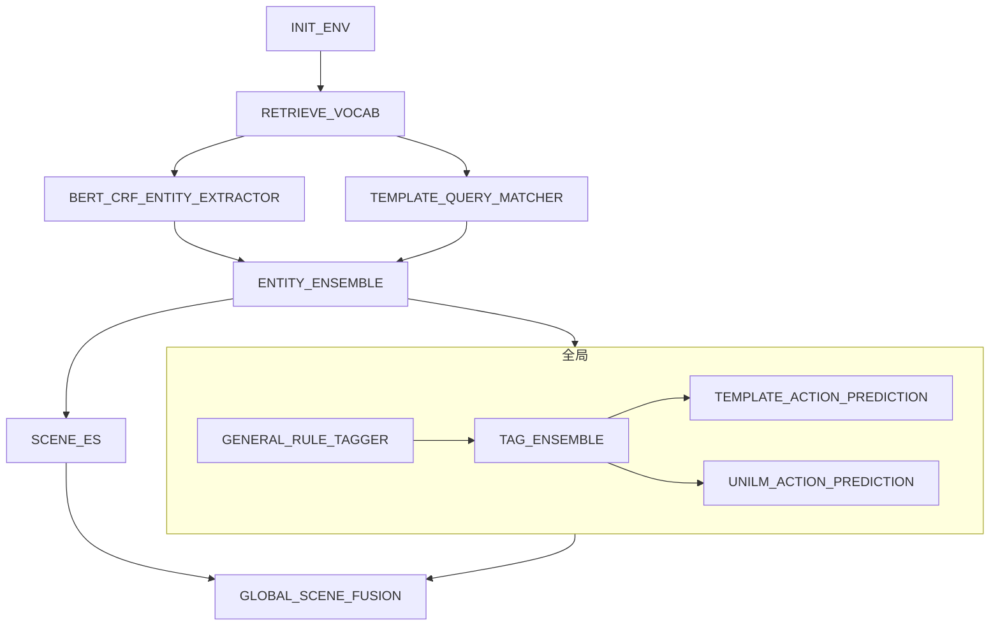
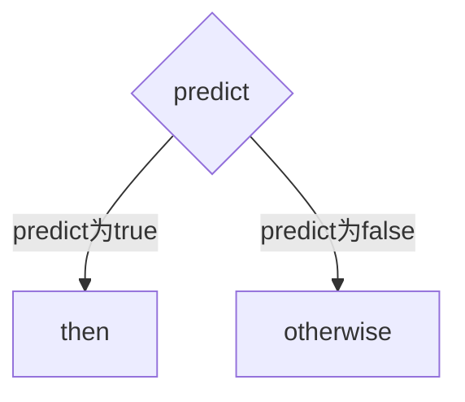
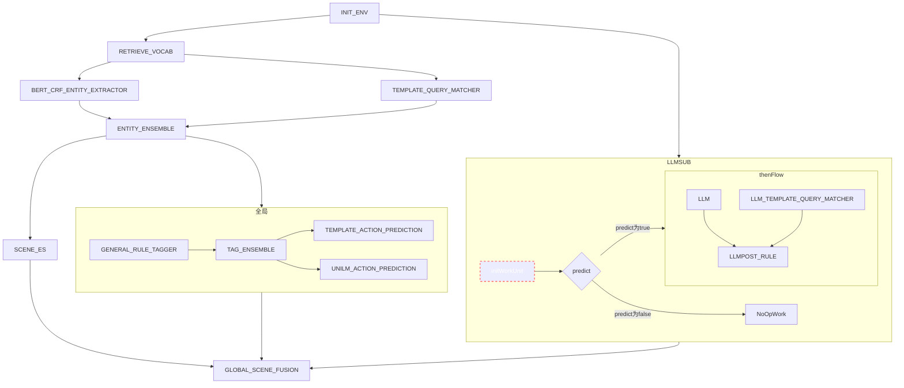
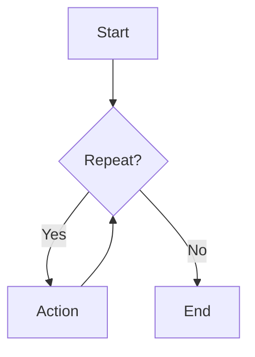

# 1.simple workflow



## template json

```json
{
  "name": "工作流",
  "sequentialSteps": [
    {
      "name": "初始化操作",
      "component": "INIT_ENV"
    },
    {
      "name": "获取词汇表",
      "component": "RETRIEVE_VOCAB"
    },
    {
      "name": "并行执行",
      "parallelSteps": [
        {
          "component": "BERT_CRF_ENTITY_EXTRACTOR"
        },
        {
          "component": "TEMPLATE_QUERY_MATCHER"
        }
      ]
    },
    {
      "name": "实体集成",
      "component": "ENTITY_ENSEMBLE"
    },
    {
      "name": "并行执行全局节点和可见及可说节点",
      "parallelSteps": [
        {
          "name": "全局节点",
          "sequentialSteps": [
            {
              "name": "初始化操作",
              "component": "GENERAL_RULE_TAGGER"
            },
            {
              "name": "标签集成",
              "component": "TAG_ENSEMBLE"
            },
            {
              "name": "并行执行预测",
              "parallelSteps": [
                {
                  "component": "TEMPLATE_ACTION_PREDICTION"
                },
                {
                  "component": "UNILM_ACTION_PREDICTION"
                }
              ]
            }
          ]
        },
        {
          "name": "场景ES",
          "component": "SCENE_ES"
        }
      ]
    },
    {
      "name": "全局场景融合",
      "component": "GLOBAL_SCENE_FUSION"
    }
  ]
}
```

## UT

``` shell
mvn clean test -D test=com.xiaopeng.workflow.HelloEasyFlowBpmnApplicationTests#testConvertXPComp -e

11:37:38.315 [main] INFO   - ===================> sequential ULY9n94D build start <====================
11:37:38.318 [main] INFO   - build single component:INIT_ENV
11:37:38.318 [main] INFO   - build single component:RETRIEVE_VOCAB
11:37:38.318 [main] INFO   - ===================> parallel dA7jGnb4 build start <====================
11:37:38.318 [main] INFO   - build single component:BERT_CRF_ENTITY_EXTRACTOR
11:37:38.319 [main] INFO   - build single component:TEMPLATE_QUERY_MATCHER
11:37:38.331 [main] INFO   - =======> build parallel dA7jGnb4 flow success, component info  ==> {"name":"并行执行","parallelSteps":[{"component":"BERT_CRF_ENTITY_EXTRACTOR","type":"single"},{"component":"TEMPLATE_QUERY_MATCHER","type":"single"}],"type":"parallel"} <===
11:37:38.357 [main] INFO   - build single component:ENTITY_ENSEMBLE
11:37:38.357 [main] INFO   - ===================> parallel wPyDLLfE build start <====================
11:37:38.357 [main] INFO   - ===================> sequential oZa3MR3x build start <====================
11:37:38.358 [main] INFO   - build single component:GENERAL_RULE_TAGGER
11:37:38.358 [main] INFO   - build single component:TAG_ENSEMBLE
11:37:38.358 [main] INFO   - ===================> parallel GJLQBFkH build start <====================
11:37:38.358 [main] INFO   - build single component:TEMPLATE_ACTION_PREDICTION
11:37:38.358 [main] INFO   - build single component:UNILM_ACTION_PREDICTION
11:37:38.359 [main] INFO   - =======> build parallel GJLQBFkH flow success, component info  ==> {"name":"并行执行预测","parallelSteps":[{"component":"TEMPLATE_ACTION_PREDICTION","type":"single"},{"component":"UNILM_ACTION_PREDICTION","type":"single"}],"type":"parallel"} <===
11:37:38.362 [main] INFO   - =======> build sequential oZa3MR3x flow success, component info  ==> {"name":"全局节点","sequentialSteps":[{"name":"初始化操作","component":"GENERAL_RULE_TAGGER","type":"single"},{"name":"标签集成","component":"TAG_ENSEMBLE","type":"single"},{"name":"并行执行预测","parallelSteps":[{"component":"TEMPLATE_ACTION_PREDICTION","type":"single"},{"component":"UNILM_ACTION_PREDICTION","type":"single"}],"type":"parallel"}],"type":"sequential"} <===
11:37:38.367 [main] INFO   - build single component:SCENE_ES
11:37:38.369 [main] INFO   - =======> build parallel wPyDLLfE flow success, component info  ==> {"name":"并行执行全局节点和可见及可说节点","parallelSteps":[{"name":"全局节点","sequentialSteps":[{"name":"初始化操作","component":"GENERAL_RULE_TAGGER","type":"single"},{"name":"标签集成","component":"TAG_ENSEMBLE","type":"single"},{"name":"并行执行预测","parallelSteps":[{"component":"TEMPLATE_ACTION_PREDICTION","type":"single"},{"component":"UNILM_ACTION_PREDICTION","type":"single"}],"type":"parallel"}],"type":"sequential"},{"name":"场景ES","component":"SCENE_ES","type":"single"}],"type":"parallel"} <===
11:37:38.370 [main] INFO   - build single component:GLOBAL_SCENE_FUSION
11:37:38.374 [main] INFO   - =======> build sequential ULY9n94D flow success, component info  ==> {"name":"工作流","sequentialSteps":[{"name":"初始化操作","component":"INIT_ENV","type":"single"},{"name":"获取词汇表","component":"RETRIEVE_VOCAB","type":"single"},{"name":"并行执行","parallelSteps":[{"component":"BERT_CRF_ENTITY_EXTRACTOR","type":"single"},{"component":"TEMPLATE_QUERY_MATCHER","type":"single"}],"type":"parallel"},{"name":"实体集成","component":"ENTITY_ENSEMBLE","type":"single"},{"name":"并行执行全局节点和可见及可说节点","parallelSteps":[{"name":"全局节点","sequentialSteps":[{"name":"初始化操作","component":"GENERAL_RULE_TAGGER","type":"single"},{"name":"标签集成","component":"TAG_ENSEMBLE","type":"single"},{"name":"并行执行预测","parallelSteps":[{"component":"TEMPLATE_ACTION_PREDICTION","type":"single"},{"component":"UNILM_ACTION_PREDICTION","type":"single"}],"type":"parallel"}],"type":"sequential"},{"name":"场景ES","component":"SCENE_ES","type":"single"}],"type":"parallel"},{"name":"全局场景融合","component":"GLOBAL_SCENE_FUSION","type":"single"}],"type":"sequential"} <===
11:37:38.376 [main] INFO   - Running workflow ''工作流''
11:37:38.376 [main] INFO   - INIT_ENV execute start
11:37:42.516 [main] INFO   - INIT_ENV execute end ==> cost time:4134ms
11:37:42.516 [main] INFO   - RETRIEVE_VOCAB execute start
11:37:47.387 [main] INFO   - RETRIEVE_VOCAB execute end ==> cost time:4867ms
11:37:47.390 [pool-1-thread-1] INFO   - BERT_CRF_ENTITY_EXTRACTOR execute start
11:37:47.390 [pool-1-thread-2] INFO   - TEMPLATE_QUERY_MATCHER execute start
11:37:49.884 [pool-1-thread-1] INFO   - BERT_CRF_ENTITY_EXTRACTOR execute end ==> cost time:2490ms
11:37:52.385 [pool-1-thread-2] INFO   - TEMPLATE_QUERY_MATCHER execute end ==> cost time:4991ms
11:37:52.385 [main] INFO   - ENTITY_ENSEMBLE execute start
11:37:56.389 [main] INFO   - ENTITY_ENSEMBLE execute end ==> cost time:4000ms
11:37:56.390 [pool-1-thread-3] INFO   - GENERAL_RULE_TAGGER execute start
11:37:56.390 [pool-1-thread-4] INFO   - SCENE_ES execute start
11:37:56.446 [pool-1-thread-3] INFO   - GENERAL_RULE_TAGGER execute end ==> cost time:51ms
11:37:56.446 [pool-1-thread-3] INFO   - TAG_ENSEMBLE execute start
11:37:59.189 [pool-1-thread-4] INFO   - SCENE_ES execute end ==> cost time:2796ms
11:38:00.987 [pool-1-thread-3] INFO   - TAG_ENSEMBLE execute end ==> cost time:4536ms
11:38:00.987 [pool-1-thread-5] INFO   - TEMPLATE_ACTION_PREDICTION execute start
11:38:00.987 [pool-1-thread-6] INFO   - UNILM_ACTION_PREDICTION execute start
11:38:01.663 [pool-1-thread-6] INFO   - UNILM_ACTION_PREDICTION execute end ==> cost time:673ms
11:38:05.296 [pool-1-thread-5] INFO   - TEMPLATE_ACTION_PREDICTION execute end ==> cost time:4304ms
11:38:05.296 [main] INFO   - globalSceneFusion execute start
11:38:08.398 [main] INFO   - GLOBAL_SCENE_FUSION execute end ==> cost time:3098ms
11:38:08.398 [main] INFO   - report:DefaultWorkReport {status=COMPLETED, context=context={}}, error=''}


```

# 2. condition Flow

## condition Flow define

1. prediction 若不指定实现，默认为false (但otherWise指定不指定也不会执行，默认直接返回 COMPLETE)
2. then & otherwise 可以为一个树状workFLow or 单个component




## template json
```json
{
  "name": "工作流",
  "type": "sequential",
  "sequentialSteps": [
    {
      "name": "初始化操作",
      "component": "INIT_ENV"
    },
    {
      "name": "e2e and llm flow",
      "type": "parallel",
      "parallelSteps": [
        {
          "name": "e2e-flow",
          "type": "sequential",
          "sequentialSteps": [
            {
              "name": "获取词汇表",
              "component": "RETRIEVE_VOCAB"
            },
            {
              "name": "并行执行",
              "type": "parallel",
              "parallelSteps": [
                {
                  "component": "BERT_CRF_ENTITY_EXTRACTOR"
                },
                {
                  "component": "TEMPLATE_QUERY_MATCHER"
                }
              ]
            },
            {
              "name": "实体集成",
              "component": "ENTITY_ENSEMBLE"
            },
            {
              "name": "并行执行全局节点和可见及可说节点",
              "type": "parallel",
              "parallelSteps": [
                {
                  "name": "全局节点",
                  "type": "sequential",
                  "sequentialSteps": [
                    {
                      "name": "初始化操作",
                      "component": "GENERAL_RULE_TAGGER"
                    },
                    {
                      "name": "标签集成",
                      "component": "TAG_ENSEMBLE"
                    },
                    {
                      "name": "并行执行预测",
                      "type": "parallel",
                      "parallelSteps": [
                        {
                          "component": "TEMPLATE_ACTION_PREDICTION"
                        },
                        {
                          "component": "UNILM_ACTION_PREDICTION"
                        }
                      ]
                    }
                  ]
                },
                {
                  "name": "场景ES",
                  "component": "SCENE_ES"
                }
              ]
            }
          ]
        },
        {
          "name": "llm 链路",
          "type": "conditional",
          "predicateClassName": "com.xiaopeng.workflow.components.predict.XGPTSwitchPredicate",
          "sequentialSteps": [
            {
              "name": "thenWorkFlow",
              "type": "sequential",
              "conditionStep": 1,
              "sequentialSteps": [
                {
                  "name": "llmParael",
                  "type": "parallel",
                  "parallelSteps": [
                    {
                      "name": "LLM",
                      "component": "LLM"
                    },
                    {
                      "name": "LLM_TEMPLATE_QUERY_MATCHER",
                      "component": "LLM_TEMPLATE_QUERY_MATCHER"
                    }
                  ]
                },
                {
                  "name": "LLMPOST_RULE",
                  "component": "LLMPOST_RULE"
                }
              ]
            }
          ]
        }
      ]
    },
    {
      "name": "全局场景融合",
      "component": "GLOBAL_SCENE_FUSION"
    }
  ]
}
```

## UT
```shell
mvn clean test -D test=com.xiaopeng.workflow.HelloEasyFlowBpmnApplicationTests#testConditionXPComp -e


17:49:32.863 [main] INFO   - ===================> sequential P3iXnl51 build start <====================
17:49:32.865 [main] INFO   - build single component:INIT_ENV
17:49:32.865 [main] INFO   - ===================> parallel ipCEhqfM build start <====================
17:49:32.865 [main] INFO   - ===================> sequential roINUndP build start <====================
17:49:32.865 [main] INFO   - build single component:RETRIEVE_VOCAB
17:49:32.865 [main] INFO   - ===================> parallel xcz9s9lM build start <====================
17:49:32.865 [main] INFO   - build single component:BERT_CRF_ENTITY_EXTRACTOR
17:49:32.865 [main] INFO   - build single component:TEMPLATE_QUERY_MATCHER
17:49:32.873 [main] INFO   - =======> build parallel xcz9s9lM flow success, component info  ==> {"name":"并行执行","conditionStep":1,"type":"parallel","parallelSteps":[{"component":"BERT_CRF_ENTITY_EXTRACTOR","conditionStep":1,"type":"single"},{"component":"TEMPLATE_QUERY_MATCHER","conditionStep":1,"type":"single"}]} <===
17:49:32.889 [main] INFO   - build single component:ENTITY_ENSEMBLE
17:49:32.890 [main] INFO   - ===================> parallel ZZ7bxtOx build start <====================
17:49:32.890 [main] INFO   - ===================> sequential 6RPKBSHg build start <====================
17:49:32.890 [main] INFO   - build single component:GENERAL_RULE_TAGGER
17:49:32.890 [main] INFO   - build single component:TAG_ENSEMBLE
17:49:32.890 [main] INFO   - ===================> parallel rWu5Wg7o build start <====================
17:49:32.890 [main] INFO   - build single component:TEMPLATE_ACTION_PREDICTION
17:49:32.890 [main] INFO   - build single component:UNILM_ACTION_PREDICTION
17:49:32.891 [main] INFO   - =======> build parallel rWu5Wg7o flow success, component info  ==> {"name":"并行执行预测","conditionStep":1,"type":"parallel","parallelSteps":[{"component":"TEMPLATE_ACTION_PREDICTION","conditionStep":1,"type":"single"},{"component":"UNILM_ACTION_PREDICTION","conditionStep":1,"type":"single"}]} <===
17:49:32.894 [main] INFO   - =======> build sequential 6RPKBSHg flow success, component info  ==> {"name":"全局节点","conditionStep":1,"type":"sequential","sequentialSteps":[{"name":"初始化操作","component":"GENERAL_RULE_TAGGER","conditionStep":1,"type":"single"},{"name":"标签集成","component":"TAG_ENSEMBLE","conditionStep":1,"type":"single"},{"name":"并行执行预测","conditionStep":1,"type":"parallel","parallelSteps":[{"component":"TEMPLATE_ACTION_PREDICTION","conditionStep":1,"type":"single"},{"component":"UNILM_ACTION_PREDICTION","conditionStep":1,"type":"single"}]}]} <===
17:49:32.896 [main] INFO   - build single component:SCENE_ES
17:49:32.898 [main] INFO   - =======> build parallel ZZ7bxtOx flow success, component info  ==> {"name":"并行执行全局节点和可见及可说节点","conditionStep":1,"type":"parallel","parallelSteps":[{"name":"全局节点","conditionStep":1,"type":"sequential","sequentialSteps":[{"name":"初始化操作","component":"GENERAL_RULE_TAGGER","conditionStep":1,"type":"single"},{"name":"标签集成","component":"TAG_ENSEMBLE","conditionStep":1,"type":"single"},{"name":"并行执行预测","conditionStep":1,"type":"parallel","parallelSteps":[{"component":"TEMPLATE_ACTION_PREDICTION","conditionStep":1,"type":"single"},{"component":"UNILM_ACTION_PREDICTION","conditionStep":1,"type":"single"}]}]},{"name":"场景ES","component":"SCENE_ES","conditionStep":1,"type":"single"}]} <===
17:49:32.900 [main] INFO   - =======> build sequential roINUndP flow success, component info  ==> {"name":"e2e-flow","conditionStep":1,"type":"sequential","sequentialSteps":[{"name":"获取词汇表","component":"RETRIEVE_VOCAB","conditionStep":1,"type":"single"},{"name":"并行执行","conditionStep":1,"type":"parallel","parallelSteps":[{"component":"BERT_CRF_ENTITY_EXTRACTOR","conditionStep":1,"type":"single"},{"component":"TEMPLATE_QUERY_MATCHER","conditionStep":1,"type":"single"}]},{"name":"实体集成","component":"ENTITY_ENSEMBLE","conditionStep":1,"type":"single"},{"name":"并行执行全局节点和可见及可说节点","conditionStep":1,"type":"parallel","parallelSteps":[{"name":"全局节点","conditionStep":1,"type":"sequential","sequentialSteps":[{"name":"初始化操作","component":"GENERAL_RULE_TAGGER","conditionStep":1,"type":"single"},{"name":"标签集成","component":"TAG_ENSEMBLE","conditionStep":1,"type":"single"},{"name":"并行执行预测","conditionStep":1,"type":"parallel","parallelSteps":[{"component":"TEMPLATE_ACTION_PREDICTION","conditionStep":1,"type":"single"},{"component":"UNILM_ACTION_PREDICTION","conditionStep":1,"type":"single"}]}]},{"name":"场景ES","component":"SCENE_ES","conditionStep":1,"type":"single"}]}]} <===
17:49:32.900 [main] INFO   - ===================> conditional QHwjmMdG build start <====================
17:49:36.754 [main] INFO   - ===================> sequential Y2IdeNXF build start <====================
17:49:36.755 [main] INFO   - ===================> parallel 5DesoWVK build start <====================
17:49:36.755 [main] INFO   - build single component:LLM
17:49:36.755 [main] INFO   - build single component:LLM_TEMPLATE_QUERY_MATCHER
17:49:36.757 [main] INFO   - =======> build parallel 5DesoWVK flow success, component info  ==> {"name":"llmParael","conditionStep":1,"type":"parallel","parallelSteps":[{"name":"LLM","component":"LLM","conditionStep":1,"type":"single"},{"name":"LLM_TEMPLATE_QUERY_MATCHER","component":"LLM_TEMPLATE_QUERY_MATCHER","conditionStep":1,"type":"single"}]} <===
17:49:36.757 [main] INFO   - build single component:LLMPOST_RULE
17:49:36.758 [main] INFO   - =======> build sequential Y2IdeNXF flow success, component info  ==> {"name":"thenWorkFlow","conditionStep":1,"type":"sequential","sequentialSteps":[{"name":"llmParael","conditionStep":1,"type":"parallel","parallelSteps":[{"name":"LLM","component":"LLM","conditionStep":1,"type":"single"},{"name":"LLM_TEMPLATE_QUERY_MATCHER","component":"LLM_TEMPLATE_QUERY_MATCHER","conditionStep":1,"type":"single"}]},{"name":"LLMPOST_RULE","component":"LLMPOST_RULE","conditionStep":1,"type":"single"}]} <===
17:49:36.761 [main] INFO   - =======> build conditional QHwjmMdG flow success, component info  ==> {"name":"llm 链路","conditionStep":1,"type":"conditional","predicateClassName":"com.xiaopeng.workflow.components.predict.XGPTSwitchPredicate","sequentialSteps":[{"name":"thenWorkFlow","conditionStep":1,"type":"sequential","sequentialSteps":[{"name":"llmParael","conditionStep":1,"type":"parallel","parallelSteps":[{"name":"LLM","component":"LLM","conditionStep":1,"type":"single"},{"name":"LLM_TEMPLATE_QUERY_MATCHER","component":"LLM_TEMPLATE_QUERY_MATCHER","conditionStep":1,"type":"single"}]},{"name":"LLMPOST_RULE","component":"LLMPOST_RULE","conditionStep":1,"type":"single"}]}]} <===
17:49:36.778 [main] INFO   - =======> build parallel ipCEhqfM flow success, component info  ==> {"name":"e2e and llm flow","conditionStep":1,"type":"parallel","parallelSteps":[{"name":"e2e-flow","conditionStep":1,"type":"sequential","sequentialSteps":[{"name":"获取词汇表","component":"RETRIEVE_VOCAB","conditionStep":1,"type":"single"},{"name":"并行执行","conditionStep":1,"type":"parallel","parallelSteps":[{"component":"BERT_CRF_ENTITY_EXTRACTOR","conditionStep":1,"type":"single"},{"component":"TEMPLATE_QUERY_MATCHER","conditionStep":1,"type":"single"}]},{"name":"实体集成","component":"ENTITY_ENSEMBLE","conditionStep":1,"type":"single"},{"name":"并行执行全局节点和可见及可说节点","conditionStep":1,"type":"parallel","parallelSteps":[{"name":"全局节点","conditionStep":1,"type":"sequential","sequentialSteps":[{"name":"初始化操作","component":"GENERAL_RULE_TAGGER","conditionStep":1,"type":"single"},{"name":"标签集成","component":"TAG_ENSEMBLE","conditionStep":1,"type":"single"},{"name":"并行执行预测","conditionStep":1,"type":"parallel","parallelSteps":[{"component":"TEMPLATE_ACTION_PREDICTION","conditionStep":1,"type":"single"},{"component":"UNILM_ACTION_PREDICTION","conditionStep":1,"type":"single"}]}]},{"name":"场景ES","component":"SCENE_ES","conditionStep":1,"type":"single"}]}]},{"name":"llm 链路","conditionStep":1,"type":"conditional","predicateClassName":"com.xiaopeng.workflow.components.predict.XGPTSwitchPredicate","sequentialSteps":[{"name":"thenWorkFlow","conditionStep":1,"type":"sequential","sequentialSteps":[{"name":"llmParael","conditionStep":1,"type":"parallel","parallelSteps":[{"name":"LLM","component":"LLM","conditionStep":1,"type":"single"},{"name":"LLM_TEMPLATE_QUERY_MATCHER","component":"LLM_TEMPLATE_QUERY_MATCHER","conditionStep":1,"type":"single"}]},{"name":"LLMPOST_RULE","component":"LLMPOST_RULE","conditionStep":1,"type":"single"}]}]}]} <===
17:49:36.778 [main] INFO   - build single component:GLOBAL_SCENE_FUSION
17:49:36.784 [main] INFO   - =======> build sequential P3iXnl51 flow success, component info  ==> {"name":"工作流","conditionStep":1,"type":"sequential","sequentialSteps":[{"name":"初始化操作","component":"INIT_ENV","conditionStep":1,"type":"single"},{"name":"e2e and llm flow","conditionStep":1,"type":"parallel","parallelSteps":[{"name":"e2e-flow","conditionStep":1,"type":"sequential","sequentialSteps":[{"name":"获取词汇表","component":"RETRIEVE_VOCAB","conditionStep":1,"type":"single"},{"name":"并行执行","conditionStep":1,"type":"parallel","parallelSteps":[{"component":"BERT_CRF_ENTITY_EXTRACTOR","conditionStep":1,"type":"single"},{"component":"TEMPLATE_QUERY_MATCHER","conditionStep":1,"type":"single"}]},{"name":"实体集成","component":"ENTITY_ENSEMBLE","conditionStep":1,"type":"single"},{"name":"并行执行全局节点和可见及可说节点","conditionStep":1,"type":"parallel","parallelSteps":[{"name":"全局节点","conditionStep":1,"type":"sequential","sequentialSteps":[{"name":"初始化操作","component":"GENERAL_RULE_TAGGER","conditionStep":1,"type":"single"},{"name":"标签集成","component":"TAG_ENSEMBLE","conditionStep":1,"type":"single"},{"name":"并行执行预测","conditionStep":1,"type":"parallel","parallelSteps":[{"component":"TEMPLATE_ACTION_PREDICTION","conditionStep":1,"type":"single"},{"component":"UNILM_ACTION_PREDICTION","conditionStep":1,"type":"single"}]}]},{"name":"场景ES","component":"SCENE_ES","conditionStep":1,"type":"single"}]}]},{"name":"llm 链路","conditionStep":1,"type":"conditional","predicateClassName":"com.xiaopeng.workflow.components.predict.XGPTSwitchPredicate","sequentialSteps":[{"name":"thenWorkFlow","conditionStep":1,"type":"sequential","sequentialSteps":[{"name":"llmParael","conditionStep":1,"type":"parallel","parallelSteps":[{"name":"LLM","component":"LLM","conditionStep":1,"type":"single"},{"name":"LLM_TEMPLATE_QUERY_MATCHER","component":"LLM_TEMPLATE_QUERY_MATCHER","conditionStep":1,"type":"single"}]},{"name":"LLMPOST_RULE","component":"LLMPOST_RULE","conditionStep":1,"type":"single"}]}]}]},{"name":"全局场景融合","component":"GLOBAL_SCENE_FUSION","conditionStep":1,"type":"single"}]} <===
17:49:36.791 [main] INFO   - Running workflow ''工作流''
17:49:36.792 [main] INFO   - INIT_ENV execute start
17:49:40.625 [main] INFO   - INIT_ENV execute end ==> cost time:3829ms
17:49:40.628 [pool-1-thread-1] INFO   - RETRIEVE_VOCAB execute start
17:49:40.628 [pool-1-thread-2] INFO   - XgptSwitchPredicate 大模型开关开启状态 ==> true
17:49:40.629 [pool-1-thread-3] INFO   - LLM execute start
17:49:40.629 [pool-1-thread-4] INFO   - LLM_TEMPLATE_QUERY_MATCHER execute start
17:49:43.761 [pool-1-thread-1] INFO   - RETRIEVE_VOCAB execute end ==> cost time:3130ms
17:49:43.763 [pool-1-thread-5] INFO   - BERT_CRF_ENTITY_EXTRACTOR execute start
17:49:43.763 [pool-1-thread-6] INFO   - TEMPLATE_QUERY_MATCHER execute start
17:49:44.034 [pool-1-thread-3] INFO   - LLM execute end ==> cost time:3402ms
17:49:44.831 [pool-1-thread-6] INFO   - TEMPLATE_QUERY_MATCHER execute end ==> cost time:1068ms
17:49:45.427 [pool-1-thread-4] INFO   - LLM_TEMPLATE_QUERY_MATCHER execute end ==> cost time:4794ms
17:49:45.427 [pool-1-thread-2] INFO   - LLMPOST_RULE execute start
17:49:45.835 [pool-1-thread-2] INFO   - LLMPOST_RULE execute end ==> cost time:403ms
17:49:48.380 [pool-1-thread-5] INFO   - BERT_CRF_ENTITY_EXTRACTOR execute end ==> cost time:4612ms
17:49:48.380 [pool-1-thread-1] INFO   - ENTITY_ENSEMBLE execute start
17:49:51.788 [pool-1-thread-1] INFO   - ENTITY_ENSEMBLE execute end ==> cost time:3403ms
17:49:51.790 [pool-1-thread-8] INFO   - SCENE_ES execute start
17:49:51.790 [pool-1-thread-7] INFO   - GENERAL_RULE_TAGGER execute start
17:49:52.988 [pool-1-thread-7] INFO   - GENERAL_RULE_TAGGER execute end ==> cost time:1194ms
17:49:52.989 [pool-1-thread-7] INFO   - TAG_ENSEMBLE execute start
17:49:54.639 [pool-1-thread-8] INFO   - SCENE_ES execute end ==> cost time:2848ms
17:49:56.843 [pool-1-thread-7] INFO   - TAG_ENSEMBLE execute end ==> cost time:3854ms
17:49:56.844 [pool-1-thread-10] INFO   - UNILM_ACTION_PREDICTION execute start
17:49:56.844 [pool-1-thread-9] INFO   - TEMPLATE_ACTION_PREDICTION execute start
17:50:00.900 [pool-1-thread-9] INFO   - TEMPLATE_ACTION_PREDICTION execute end ==> cost time:4051ms
17:50:01.695 [pool-1-thread-10] INFO   - UNILM_ACTION_PREDICTION execute end ==> cost time:4849ms
17:50:01.695 [main] INFO   - globalSceneFusion execute start
17:50:02.770 [main] INFO   - GLOBAL_SCENE_FUSION execute end ==> cost time:1070ms
17:50:02.771 [main] INFO   - report:DefaultWorkReport {status=COMPLETED, context=context={XGPTSwitch=true}}, error=''}

```


# 3. repeat Flow

## repeat Flow define



1. prediction 若不指定实现，默认为false Action 只会执行一次，然后向下执行
2. Action 若不指定 implement 默认为 NoOpWork 直接返回 COMPLETE

