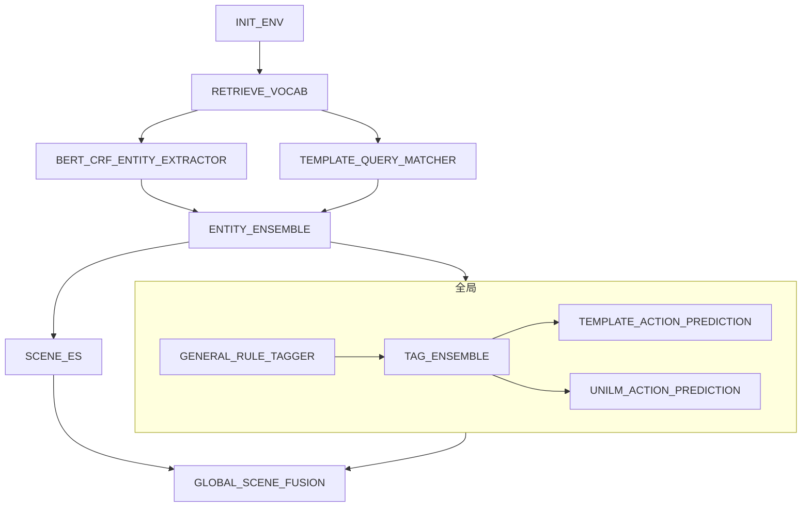

# 1.simple workflow



## template json

```json
{
  "name": "工作流",
  "sequentialSteps": [
    {
      "name": "初始化操作",
      "component": "INIT_ENV"
    },
    {
      "name": "获取词汇表",
      "component": "RETRIEVE_VOCAB"
    },
    {
      "name": "并行执行",
      "parallelSteps": [
        {
          "component": "BERT_CRF_ENTITY_EXTRACTOR"
        },
        {
          "component": "TEMPLATE_QUERY_MATCHER"
        }
      ]
    },
    {
      "name": "实体集成",
      "component": "ENTITY_ENSEMBLE"
    },
    {
      "name": "并行执行全局节点和可见及可说节点",
      "parallelSteps": [
        {
          "name": "全局节点",
          "sequentialSteps": [
            {
              "name": "初始化操作",
              "component": "GENERAL_RULE_TAGGER"
            },
            {
              "name": "标签集成",
              "component": "TAG_ENSEMBLE"
            },
            {
              "name": "并行执行预测",
              "parallelSteps": [
                {
                  "component": "TEMPLATE_ACTION_PREDICTION"
                },
                {
                  "component": "UNILM_ACTION_PREDICTION"
                }
              ]
            }
          ]
        },
        {
          "name": "场景ES",
          "component": "SCENE_ES"
        }
      ]
    },
    {
      "name": "全局场景融合",
      "component": "GLOBAL_SCENE_FUSION"
    }
  ]
}
```

## UT
``` shell
mvn clean test -D test=com.xiaopeng.workflow.HelloEasyFlowBpmnApplicationTests#testConvertXPComp -e

20:29:56.351 [main] INFO   - ===================> sequential build start <====================
20:29:56.351 [main] INFO   - build single component:INIT_ENV
20:29:56.353 [main] INFO   - build single component:RETRIEVE_VOCAB
20:29:56.353 [main] INFO   - ===================> parallel build start <====================
20:29:56.353 [main] INFO   - build single component:BERT_CRF_ENTITY_EXTRACTOR
20:29:56.353 [main] INFO   - build single component:TEMPLATE_QUERY_MATCHER
20:29:56.359 [main] INFO   - =======> build parallel flow success, component info  ==> {"name":"并行执行","parallelSteps":[{"component":"BERT_CRF_ENTITY_EXTRACTOR","type":"single"},{"component":"TEMPLATE_QUERY_MATCHER","type":"single"}],"type":"parallel"} <===
20:29:56.374 [main] INFO   - build single component:ENTITY_ENSEMBLE
20:29:56.374 [main] INFO   - ===================> parallel build start <====================
20:29:56.374 [main] INFO   - ===================> sequential build start <====================
20:29:56.374 [main] INFO   - build single component:GENERAL_RULE_TAGGER
20:29:56.374 [main] INFO   - build single component:TAG_ENSEMBLE
20:29:56.374 [main] INFO   - ===================> parallel build start <====================
20:29:56.374 [main] INFO   - build single component:TEMPLATE_ACTION_PREDICTION
20:29:56.374 [main] INFO   - build single component:UNILM_ACTION_PREDICTION
20:29:56.375 [main] INFO   - =======> build parallel flow success, component info  ==> {"name":"并行执行预测","parallelSteps":[{"component":"TEMPLATE_ACTION_PREDICTION","type":"single"},{"component":"UNILM_ACTION_PREDICTION","type":"single"}],"type":"parallel"} <===
20:29:56.377 [main] INFO   - =======> build sequential flow success, component info  ==> {"name":"全局节点","sequentialSteps":[{"name":"初始化操作","component":"GENERAL_RULE_TAGGER","type":"single"},{"name":"标签集成","component":"TAG_ENSEMBLE","type":"single"},{"name":"并行执行预测","parallelSteps":[{"component":"TEMPLATE_ACTION_PREDICTION","type":"single"},{"component":"UNILM_ACTION_PREDICTION","type":"single"}],"type":"parallel"}],"type":"sequential"} <===
20:29:56.381 [main] INFO   - build single component:SCENE_ES
20:29:56.383 [main] INFO   - =======> build parallel flow success, component info  ==> {"name":"并行执行全局节点和可见及可说节点","parallelSteps":[{"name":"全局节点","sequentialSteps":[{"name":"初始化操作","component":"GENERAL_RULE_TAGGER","type":"single"},{"name":"标签集成","component":"TAG_ENSEMBLE","type":"single"},{"name":"并行执行预测","parallelSteps":[{"component":"TEMPLATE_ACTION_PREDICTION","type":"single"},{"component":"UNILM_ACTION_PREDICTION","type":"single"}],"type":"parallel"}],"type":"sequential"},{"name":"场景ES","component":"SCENE_ES","type":"single"}],"type":"parallel"} <===
20:29:56.384 [main] INFO   - build single component:GLOBAL_SCENE_FUSION
20:29:56.387 [main] INFO   - =======> build sequential flow success, component info  ==> {"name":"工作流","sequentialSteps":[{"name":"初始化操作","component":"INIT_ENV","type":"single"},{"name":"获取词汇表","component":"RETRIEVE_VOCAB","type":"single"},{"name":"并行执行","parallelSteps":[{"component":"BERT_CRF_ENTITY_EXTRACTOR","type":"single"},{"component":"TEMPLATE_QUERY_MATCHER","type":"single"}],"type":"parallel"},{"name":"实体集成","component":"ENTITY_ENSEMBLE","type":"single"},{"name":"并行执行全局节点和可见及可说节点","parallelSteps":[{"name":"全局节点","sequentialSteps":[{"name":"初始化操作","component":"GENERAL_RULE_TAGGER","type":"single"},{"name":"标签集成","component":"TAG_ENSEMBLE","type":"single"},{"name":"并行执行预测","parallelSteps":[{"component":"TEMPLATE_ACTION_PREDICTION","type":"single"},{"component":"UNILM_ACTION_PREDICTION","type":"single"}],"type":"parallel"}],"type":"sequential"},{"name":"场景ES","component":"SCENE_ES","type":"single"}],"type":"parallel"},{"name":"全局场景融合","component":"GLOBAL_SCENE_FUSION","type":"single"}],"type":"sequential"} <===
20:29:56.388 [main] INFO   - Running workflow ''工作流''
20:29:56.388 [main] INFO   - INIT_ENV execute start
20:29:58.130 [main] INFO   - INIT_ENV execute end ==> cost time:1738ms
20:29:58.131 [main] INFO   - RETRIEVE_VOCAB execute start
20:30:00.040 [main] INFO   - RETRIEVE_VOCAB execute end ==> cost time:1906ms
20:30:00.041 [pool-1-thread-1] INFO   - BERT_CRF_ENTITY_EXTRACTOR execute start
20:30:00.042 [pool-1-thread-2] INFO   - TEMPLATE_QUERY_MATCHER execute start
20:30:00.762 [pool-1-thread-2] INFO   - TEMPLATE_QUERY_MATCHER execute end ==> cost time:716ms
20:30:03.374 [pool-1-thread-1] INFO   - BERT_CRF_ENTITY_EXTRACTOR execute end ==> cost time:3328ms
20:30:03.374 [main] INFO   - ENTITY_ENSEMBLE execute start
20:30:05.637 [main] INFO   - ENTITY_ENSEMBLE execute end ==> cost time:2258ms
20:30:05.638 [pool-1-thread-3] INFO   - GENERAL_RULE_TAGGER execute start
20:30:05.638 [pool-1-thread-4] INFO   - SCENE_ES execute start
20:30:08.340 [pool-1-thread-4] INFO   - SCENE_ES execute end ==> cost time:2697ms
20:30:10.611 [pool-1-thread-3] INFO   - GENERAL_RULE_TAGGER execute end ==> cost time:4969ms
20:30:10.612 [pool-1-thread-3] INFO   - TAG_ENSEMBLE execute start
20:30:13.369 [pool-1-thread-3] INFO   - TAG_ENSEMBLE execute end ==> cost time:2753ms
20:30:13.369 [pool-1-thread-5] INFO   - TEMPLATE_ACTION_PREDICTION execute start
20:30:13.370 [pool-1-thread-6] INFO   - UNILM_ACTION_PREDICTION execute start
20:30:16.557 [pool-1-thread-6] INFO   - UNILM_ACTION_PREDICTION execute end ==> cost time:3184ms
20:30:17.890 [pool-1-thread-5] INFO   - TEMPLATE_ACTION_PREDICTION execute end ==> cost time:4517ms
20:30:17.890 [main] INFO   - globalSceneFusion execute start
20:30:21.065 [main] INFO   - GLOBAL_SCENE_FUSION execute end ==> cost time:3170ms
20:30:21.065 [main] INFO   - report:DefaultWorkReport {status=COMPLETED, context=context={}}, error=''}


```